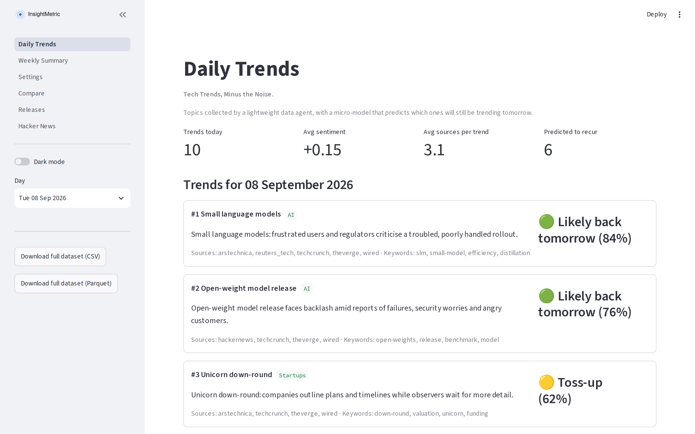

<picture>
  <source media="(prefers-color-scheme: dark)" srcset="outputs/logo_dark.svg">
  
</picture>

InsightMetric is a lightweight daily trend-intelligence dashboard. It tracks emerging
signals across AI, cybersecurity, data science and technology, groups them into clear
topics, and shows which ones look likely to still be around tomorrow.

---

## Contents

- [What it does](#what-it-does)
- [About the numbers](#about-the-numbers)
- [Features](#features)
- [Documentation](#documentation)
- [Contributing](#contributing)
- [Licence](#licence)

---

## What it does

Technology moves quickly and most of what is written about it is opinion. InsightMetric
takes a narrower, more answerable question — *is this topic still going to matter
tomorrow?* — and puts a number on it, refreshed every morning.

Each day you get a ranked list of the topics moving across technology, with a sense of how
each one is being talked about, how widely it is being covered, and how likely it is to
persist. Over a week, the weekly view shows which topics held on and which faded.

The philosophy is deliberately modest: **simple tools, powerful insights.** InsightMetric
grows over time. The longer it runs, the more history it has, and the better its picture of
what persists becomes.

## About the numbers

**Please read this before drawing conclusions from anything you see.**

InsightMetric is young. The history bundled with this project is largely **generated sample
data**, created so the dashboard has something to display and so anyone can try it without
waiting weeks. Live daily collection has only recently begun.

That means the figures on screen today demonstrate how the product works — they are not yet
findings about the real world, and they should not be quoted as such. The same applies to
anything you download. As real history accumulates, this note will change; until it does,
treat what you see as a working demonstration.

Saying this plainly matters more to us than looking established.

## Features

| | |
|---|---|
| **Daily Trends** | The day's topics, ranked, each with sentiment, coverage and a recurrence badge |
| **Weekly Summary** | A week at a glance: what persisted, what faded, how the mix shifted |
| **Category Comparison** | Two categories side by side over the full history |
| **Sentiment indicators** | How positively or negatively each topic is being discussed |
| **Keyword cloud** | The vocabulary of the day or week, sized by prominence |
| **Recurrence badge** | A traffic-light estimate of whether a topic returns tomorrow |
| **Category filters** | Narrow every page to the categories you care about |
| **Dark mode** | A one-click theme switch |
| **Download** | Take the dataset away as CSV or Parquet |

[docs/FEATURES.md](docs/FEATURES.md) describes each one in full.

## Documentation

| Document | What it covers |
|---|---|
| [Overview](docs/OVERVIEW.md) | What InsightMetric is, who it is for, and where it is going |
| [Features](docs/FEATURES.md) | Every feature, described |
| [Usage](docs/USAGE.md) | How to navigate the app and read what it shows you |
| [Architecture](docs/ARCHITECTURE.md) | How the pieces fit together, at a high level |
| [Brand](docs/BRAND.md) | Name, tagline, vision and philosophy |
| [Contributing](docs/CONTRIBUTING.md) | How to suggest or contribute an improvement |

## Contributing

Contributions are welcome — particularly interface improvements, documentation and feature
suggestions. See [docs/CONTRIBUTING.md](docs/CONTRIBUTING.md).

## Licence

MIT. See [LICENSE](LICENSE).

---

InsightMetric · Tech Trends, Minus the Noise.
