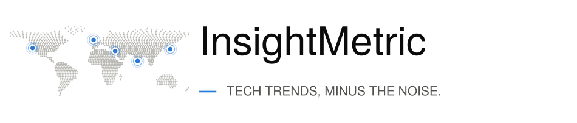

<picture>
  <source media="(prefers-color-scheme: dark)" srcset="../outputs/logo_dark.svg">
  
</picture>

# Brand specification

This is the official brand specification for InsightMetric. It governs the README, this
documentation set, the GitHub repository settings, the Streamlit application, the logo,
LinkedIn and article copy, and the roadmap.

The machine-readable half lives in [`src/brand.py`](../src/brand.py). Anything that renders
the name, the tagline, the description or a colour imports it from there rather than
hard-coding a string, so the brand can only drift in one place. **If you change something
here, change it there in the same commit.**

- [Name](#name)
- [Tagline](#tagline)
- [Descriptions](#descriptions)
- [Logo](#logo)
- [Colour](#colour)
- [Typography](#typography)
- [Voice](#voice)
- [Surface checklist](#surface-checklist)

---

## Name

**InsightMetric.** One word, two capitals, singular.

| | |
|---|---|
| Correct | InsightMetric |
| Wrong | InsightMetrics, Insight Metric, Insightmetric, INSIGHTMETRIC, insight-metric |

The one exception is a lowercase identifier where the casing is not a choice: a repository
name, a package name, a Docker image tag, a URL slug. Use `insightmetric` there — never
`insight-metric`.

Never write the name in a possessive that reads as a company ("InsightMetric's customers").
It is a project.

## Tagline

> **Tech Trends, Minus the Noise.**

Title case, always with the closing full stop. It is a statement, not a headline.

Use it once per surface, next to the name — a README header, a logo lockup, a page footer,
the first line of a post. It is not a section heading, not a sentence inside a paragraph,
and not something to repeat for emphasis.

Set in capitals only inside the logo lockup, where the letterforms carry it. In body text,
title case.

## Descriptions

Three lengths, used verbatim. Do not paraphrase them into a fourth.

**Short (the canonical description).** README opening, article standfirst, the first line of
any introduction:

> InsightMetric is a daily tech-trend intelligence system that collects signals from news,
> open-source releases and community activity, clusters them into clean topics, and predicts
> which ones will recur tomorrow — using simple, transparent models and reproducible
> pipelines.

**GitHub About** (the field is capped at 350 characters):

> Tech Trends, Minus the Noise. A daily tech-trend intelligence system: collects signals from
> news, open-source releases and community activity, clusters them into clean topics, and
> predicts which recur tomorrow. Transparent models, reproducible pipelines, no API keys.

**One line**, for a page header or a card:

> Daily tech-trend intelligence — clustered, scored, and predicted.

Both long forms end on *transparent* and *reproducible*. That is the claim the project is
actually making, and it is the one worth keeping in the last position.

## Logo

**"Signal Map"** — a dot-matrix world map in the neutral tone, carrying five accent nodes for
the domains the project watches: AI, Cloud, Cybersecurity, Developer Tools, Open Source. Each
node sits inside two fading rings, a pulse caught mid-expansion.

The node positions are chosen for visual balance across the map. **They are not a claim about
where anything happens**, and the map itself is a coarse design asset — deliberately wrong at
every coastline. Neither is data.

Generated by [`src/make_logo.py`](../src/make_logo.py) from
[`src/world.py`](../src/world.py); nothing is drawn by hand, so the whole set regenerates from
a palette change in one command:

```bash
python src/make_logo.py
```

| Asset | File | Use |
|---|---|---|
| Lockup | `outputs/logo.svg` · `.png` | README header, article header, slide title, anywhere with room |
| Lockup, no tagline | `outputs/logo_wordmark.svg` · `.png` | Narrow headers |
| Compact lockup | `outputs/logo_compact.svg` · `.png` | Small heights — the app sidebar. Node plus wordmark, no map |
| Mark | `outputs/logo_mark.svg` · `.png` | The map alone, where the name is already present |
| Avatar | `outputs/logo_avatar.svg` · `.png` | Square contexts — GitHub organisation, LinkedIn, social profiles |
| Favicon | `outputs/favicon.png` | Browser tab, Streamlit `page_icon` |
| Social preview | `outputs/logo_social.png` | GitHub repository settings → Social preview (1280×640) |

Each lockup has a `_dark` twin (`logo_dark`, `logo_wordmark_dark`, `logo_compact_dark`) in
which **only the type colour changes** — the map, the nodes and the accent are identical.
Markdown files select between them with `<picture>` and `prefers-color-scheme`; the
application picks by the current theme in `settings.brand_sidebar()`.

**Reduction.** The map reduces in one step. Below roughly 64 pixels a world map is a smudge,
so the small sizes drop to a single pulse node — the map's atomic element, legible at 16px.
The compact lockup is that node with the wordmark; the avatar and favicon are the node alone.
There is no intermediate version; do not invent one by cropping the map.

**Rules.**

- Everything except the social preview is drawn on a transparent background, so a single file
  works on both the light and the dark theme. Do not add a background plate.
- Clear space on all sides is the diameter of one outer pulse ring. Nothing sits inside it.
- Do not recolour, rotate, outline, add a gradient or a shadow, stretch, or set the lockup
  vertically. If a surface needs a shape the set does not have, add it to `make_logo.py`.
- Do not add nodes. Five is the specification, and each one names a domain.

## Colour

Monochrome plus one accent. Defined in `src/brand.py`; every colour used anywhere in the
project comes from this table.

| Token | Hex | Role |
|---|---|---|
| `SURFACE` | `#fcfcfb` | Page and chart background |
| `INK` | `#0b0b0b` | Primary text |
| `INK_SOFT` | `#52514e` | Secondary text |
| `ACCENT` | `#2a78d6` | The single accent — signal, emphasis, first series |
| `CONTRAST` | `#d1682a` | The one permitted second hue — **two-sided encodings only**, see below |
| `FADED` | `#dcdbd7` | Structure, rules, "did not recur" |
| `UNKNOWN` | `#b9b8b3` | Landmass, tertiary text, "not yet observable" |

Dark theme moves the neutrals only:

| Token | Hex |
|---|---|
| `SURFACE_DARK` | `#101113` |
| `INK_DARK` | `#f2f1ee` |
| `INK_SOFT_DARK` | `#b9b8b3` |

**The accent does not move between themes.** That fixedness is what makes `#2a78d6` read as
the brand colour rather than as a theme colour.

**Use the accent sparingly.** It marks the thing the reader should look at first, and it
cannot do that if it is everywhere. One accented element per view is the target; the
traffic-light prediction badges are the one deliberate exception, because there the colour
*is* the information.

**`CONTRAST` is for exactly two opposed sides and nothing else.** Two peer categories
compared (the Compare page), or a positive-versus-negative coefficient (the model chart).
Two peers cannot both be the accent, and greying one of them implies a hierarchy that is not
there — which is the only reason a second hue exists. Blue against orange is also the pair
that survives the common forms of colour blindness. `CONTRAST` never appears in the logo, in
a heading, as a third series, or as decoration. Anything needing more than two categories
uses the neutrals: accent, `UNKNOWN`, `FADED`.

## Typography

One family, three weights, set from `FONT_STACK` in `src/brand.py`:

```
TeX Gyre Heros → Helvetica Neue → Helvetica → Liberation Sans → Carlito → Poppins → DejaVu Sans
```

A neutral grotesque, with a fallback chain that degrades gracefully so a fresh clone still
renders sensibly on a machine with no fonts installed. Rendered assets embed type as vector
outlines, so nobody needs the font to see the logo correctly.

- Wordmark: medium weight, tight tracking, sentence case.
- Tagline in the lockup: regular, capitals, generous tracking, `INK_SOFT`.
- Body: regular. Headings: medium. Never bold-italic, never all-caps outside the lockup.

## Voice

The project's own writing style is the brand as much as the palette is.

- **Plain, specific, unhurried.** Say the number. Name the file. Give the threshold.
- **Say what it does not do.** The synthetic-versus-live caveat, the coarse map, the label
  noise, the missing test suite — every one of these appears in the documentation because
  stating a limit is what makes the rest credible.
- **No hype vocabulary.** Not *revolutionary*, *powerful*, *seamless*, *cutting-edge*,
  *AI-powered*, *unlock*, *leverage*, *game-changing*. The project's whole argument is that a
  logistic regression you can read beats a black box you cannot.
- **British spelling**, in prose and in comments: *behaviour*, *licence* (noun),
  *summarise*, *modelling*.
- **No emoji in prose.** The prediction badges in the application are the exception — they are
  interface, not writing.
- Never claim a capability the repository does not have yet. If it is on the roadmap, say it
  is on the roadmap.

## Surface checklist

Every one of these carries the branding, and every one is checked against this file before a
release.

| Surface | Carries |
|---|---|
| `README.md` | Lockup, tagline, short description |
| `CONTRIBUTING.md` | Wordmark lockup, tagline |
| `docs/*.md` | Name and voice; lockup where the document has a cover |
| GitHub About | `GITHUB_ABOUT` string, verbatim |
| GitHub social preview | `outputs/logo_social.png` |
| GitHub organisation / profile avatar | `outputs/logo_avatar.png` |
| Streamlit app | `favicon.png` as `page_icon`, `st.logo()` in the sidebar, tagline in the header |
| Article and LinkedIn posts | Name, tagline, cover image; the voice rules above |
| Roadmap documents | Name and voice; no new taglines |

Anything not on this list that shows the name should be added to it.
