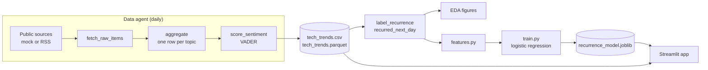
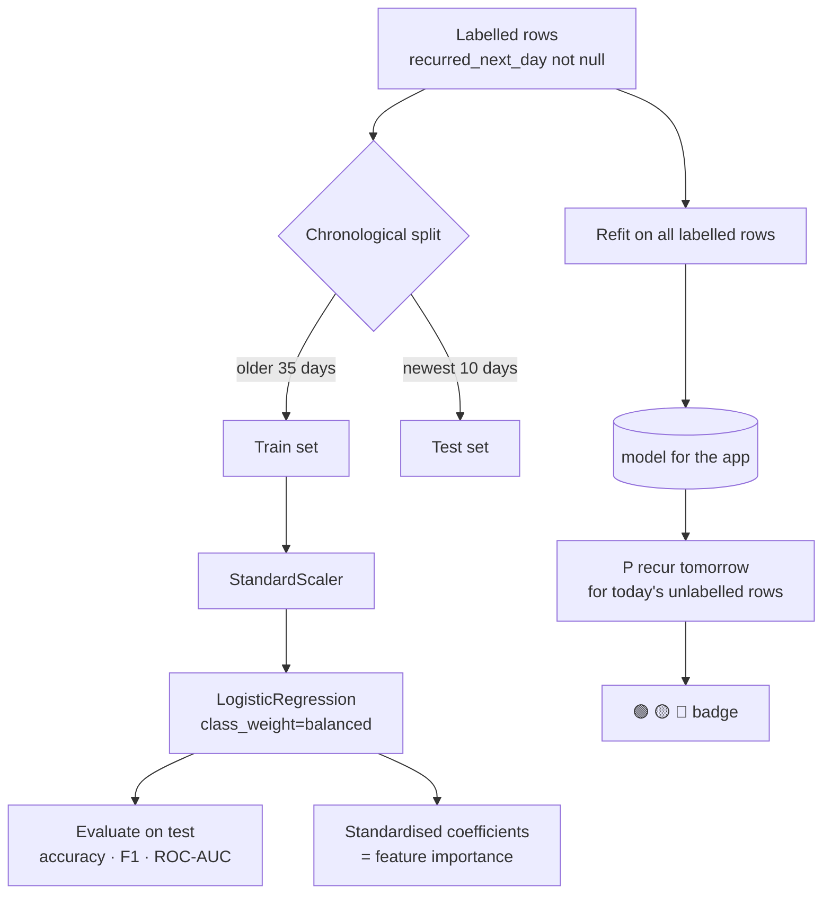
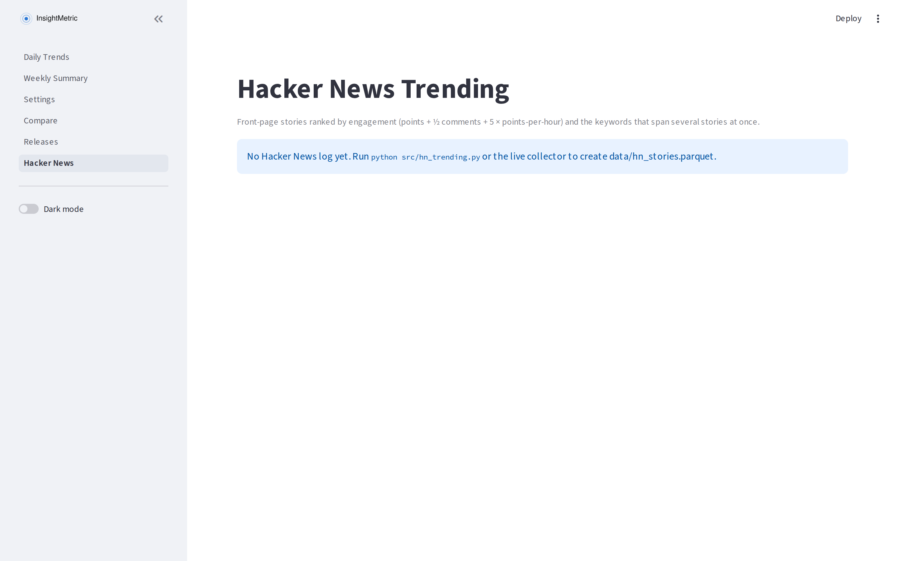
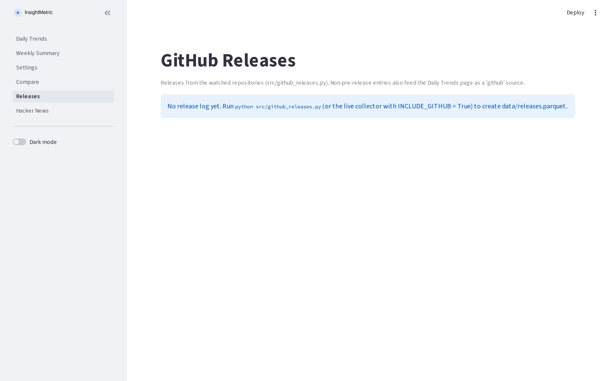
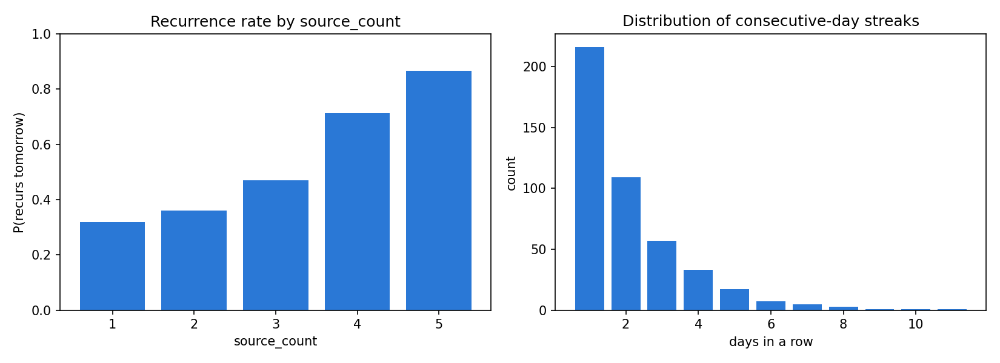
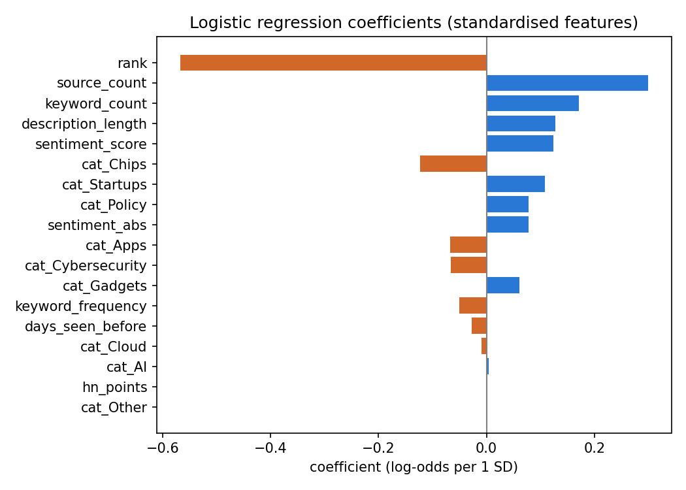
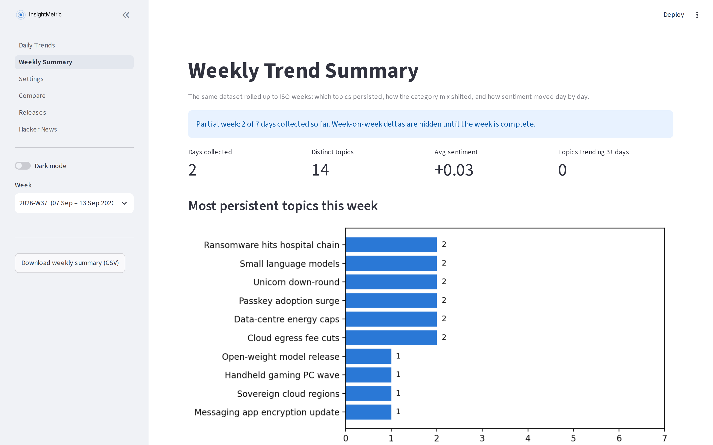
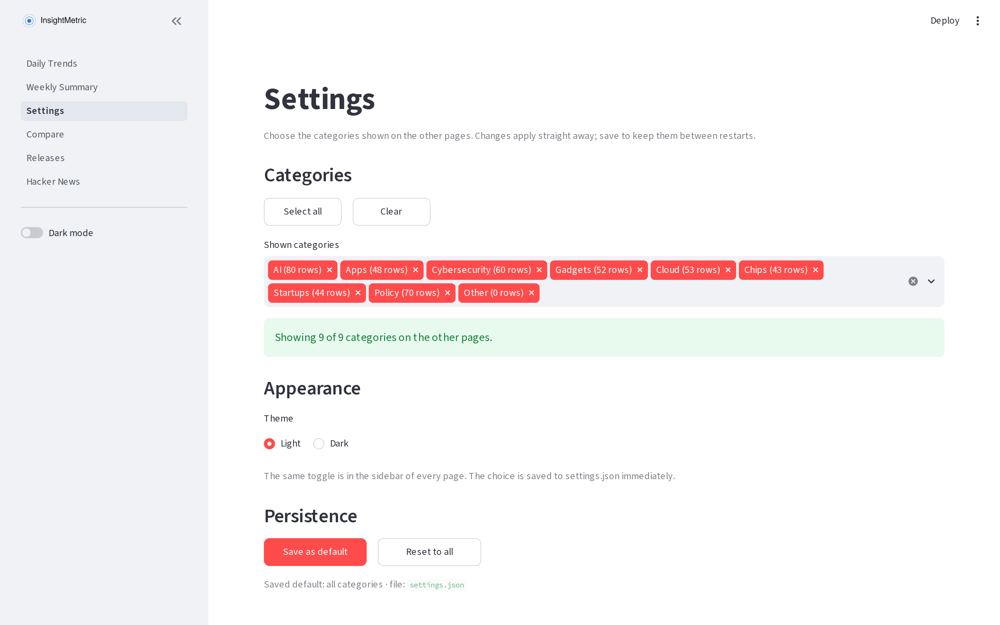
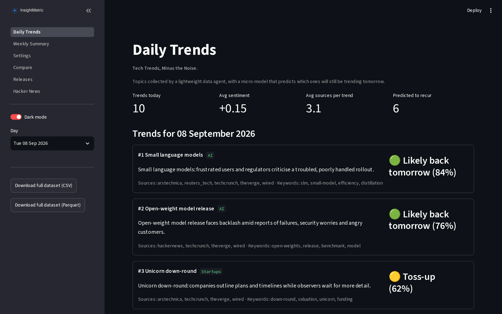
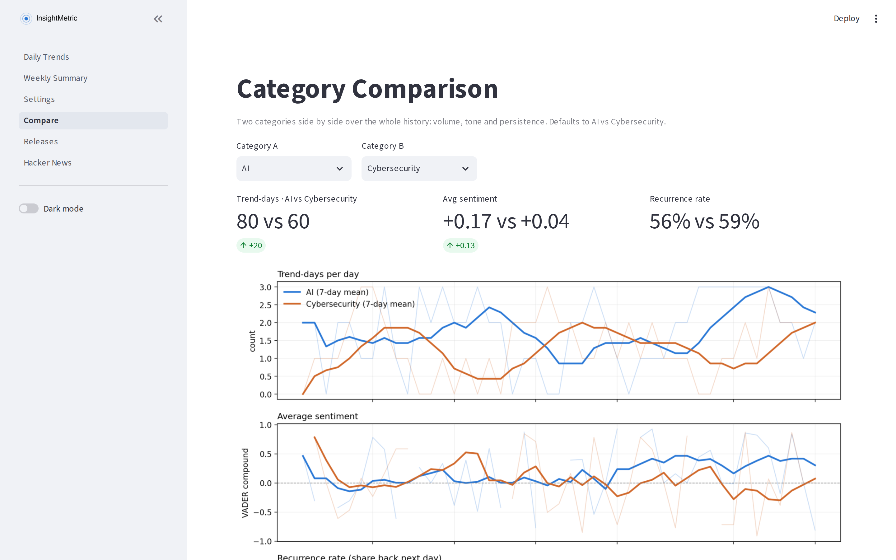

# InsightMetric: Building a Lightweight Daily Tech-Trend Intelligence System

### Tech Trends, Minus the Noise.

*InsightMetric is a daily tech-trend intelligence system that collects signals from news, open-source releases and community activity, clusters them into clean topics, and predicts which ones will recur tomorrow — using simple, transparent models and reproducible pipelines. Everything runs locally in under a minute, with no API keys.*

---

## 1. Why this project

Most "AI trend" content is opinion. This project is an attempt to make trend-watching measurable: collect a small, well-defined dataset every day, ask one narrow question of it (*will this trend still be here tomorrow?*), and answer it with the simplest model that can be explained on one slide.

The design goal is deliberately modest. A logistic regression on eight or so features will not out-forecast a newsroom, but it produces a clean, inspectable baseline, and building the whole pipeline end-to-end is where the learning is. Every listing below is the complete file, reproduced from the repository rather than retyped — a small script (`scripts/sync_article.py`) rewrites them from source, so the article cannot drift from the code it describes. The only files not printed in full are the two that generate the project's visual assets; they are described in §8e and are in the repository.

**For non-technical readers:** think of it as a daily scoreboard for tech news, with a small "sticks or fades" predictor attached to each item.

## 2. Architecture at a glance

### Data pipeline



### Model workflow



ASCII version of the pipeline, for platforms that do not render Mermaid:

```
 sources ──> fetch ──> aggregate ──> sentiment ──> CSV/Parquet ──> label ──> features ──> model
                                                       │                                   │
                                                       └──────────── Streamlit app <────────┘
```

## 3. Dataset schema

One row is one trend on one day. Every field is either observed directly by the agent or derived deterministically from observed fields.

| Field | Type | Description |
|---|---|---|
| `trend_id` | string | `sha1(date + slug(topic))[:12]` — stable across runs |
| `date` | date | Collection day (UTC); the grain of the dataset |
| `collected_at` | timestamp (UTC) | When the agent ran |
| `topic` | string | Normalised trend name |
| `description` | string | One-sentence summary |
| `category` | categorical | `AI`, `Apps`, `Cybersecurity`, `Gadgets`, `Cloud`, `Chips`, `Startups`, `Policy`, plus `Other` in live mode for items the lexicon cannot place |
| `sentiment_score` | float [-1, 1] | VADER compound polarity of the description |
| `keyword_frequency` | int | Keyword mentions across that day's headlines |
| `keywords` | string | Pipe-separated top keywords (feeds the word cloud) |
| `source_count` | int | Distinct sources mentioning the trend |
| `sources` | string | Pipe-separated source names |
| `hn_points` | int | Hacker News points of the topic's best-scoring HN story; 0 if not on HN (always 0 in mock data) |
| `rank` | int | Position in the day's list (1 = strongest) |
| `recurred_next_day` | nullable int {0,1} | **Target.** Did the topic appear the following day? Null for the latest day |

Example rows:

| trend_id | date | topic | category | sentiment_score | keyword_frequency | source_count | rank | recurred_next_day |
|---|---|---|---|---|---|---|---|---|
| a3f9c21be7d0 | 2026-09-07 | On-device LLM inference | AI | 0.42 | 17 | 4 | 2 | 1 |
| 5b7e0d9a1c44 | 2026-09-07 | Passkey adoption surge | Cybersecurity | 0.31 | 9 | 3 | 5 | 0 |
| c018e4f72a9b | 2026-09-07 | Foldable phone recall | Gadgets | -0.55 | 12 | 5 | 3 | 1 |

Two properties of the target matter for everything downstream. It is **lagged**: the label for day *D* only exists once day *D+1* has been collected, so the newest day is always unlabelled, which is exactly the set of rows the app scores. And it is **defined by the collector itself**: "recurred" means "made the agent's top-10 list again", not "was still in the news".

## 4. Data collection

The agent is written so that mock and live modes share every step except the first. `fetch_raw_items()` returns headline-like items; in mock mode it synthesises them, in live mode it would read RSS feeds. Aggregation, sentiment scoring, labelling and saving are identical either way, so the rest of the project does not care where the rows came from.

The mock is not uniform noise. Each day it carries over some of yesterday's trends according to a hidden propensity that rewards broad coverage, emotive descriptions and high rank, then tops up with fresh topics. Sentiment is computed by running VADER over templated descriptions rather than being drawn from a distribution, so the column behaves as it would on real text. The hidden rule is what the model later tries to recover, which makes the modelling step a fair test instead of a tautology.

**Project layout**

```
tech_trends/
├── Daily_Trends.py      Streamlit app (main page)
├── pages/
│   ├── 1_Weekly_Summary.py  weekly roll-up page
│   ├── 2_Settings.py        category filter
│   ├── 3_Compare.py         category comparison over time
│   ├── 4_Releases.py        GitHub release log
│   └── 5_Hacker_News.py     HN trending stories and themes
├── run_all.sh           one-shot rebuild
├── requirements.txt
├── src/
│   ├── collect.py       data agent (mock mode)
│   ├── collect_live.py  data agent (live mode, RSS)
│   ├── github_releases.py  GitHub release monitor
│   ├── hn_trending.py   Hacker News engagement
│   ├── eda.py           exploratory analysis
│   ├── features.py      feature engineering shared by training and the app
│   ├── settings.py      category selection shared by all pages
│   └── train.py         logistic regression + evaluation
├── data/  models/  outputs/
```

**requirements.txt**

```
pandas>=2.0
pyarrow>=14
scikit-learn>=1.3
matplotlib>=3.7
vaderSentiment>=3.3
streamlit>=1.30
wordcloud>=1.9
feedparser>=6.0
```

**src/collect.py**

```python
"""
InsightMetric - data agent (mock mode).

The agent has the same shape a live agent would have:

    fetch_raw_items(day)  ->  aggregate(items)  ->  score_sentiment()  ->  label_recurrence()  ->  save()

In mock mode `fetch_raw_items` synthesises headline-like items instead of
reading RSS feeds. Swapping in a live source means replacing that one
function; everything downstream is unchanged.

Run:  python src/collect.py --days 45 --seed 42
"""
from __future__ import annotations

import argparse
import hashlib
import math
import random
import re
from dataclasses import dataclass
from datetime import date, datetime, timedelta, timezone
from pathlib import Path

import pandas as pd
from vaderSentiment.vaderSentiment import SentimentIntensityAnalyzer

DATA_DIR = Path(__file__).resolve().parents[1] / "data"
CATEGORIES = ["AI", "Apps", "Cybersecurity", "Gadgets", "Cloud", "Chips", "Startups", "Policy"]
SOURCES = ["hackernews", "techcrunch", "theverge", "arstechnica", "wired", "reuters_tech"]
TRENDS_PER_DAY = 10

# ---------------------------------------------------------------------------
# Topic pool: (topic, category, keywords). A real agent would discover these
# by clustering headlines; the mock draws from a fixed pool so that the same
# topic can genuinely recur across days.
# ---------------------------------------------------------------------------
TOPIC_POOL = [
    ("On-device LLM inference", "AI", "llm|on-device|inference|npu|edge"),
    ("AI agent frameworks", "AI", "agents|framework|orchestration|tools"),
    ("Open-weight model release", "AI", "open-weights|release|benchmark|model"),
    ("AI coding assistants", "AI", "copilot|code|assistant|developer"),
    ("Multimodal video models", "AI", "video|multimodal|generation|diffusion"),
    ("AI in customer support", "AI", "support|chatbot|automation|deflection"),
    ("Small language models", "AI", "slm|small-model|efficiency|distillation"),
    ("Retrieval-augmented search", "AI", "rag|retrieval|search|embeddings"),
    ("Super-app payments push", "Apps", "super-app|payments|wallet|fintech"),
    ("Messaging app encryption update", "Apps", "messaging|encryption|e2ee|privacy"),
    ("Subscription fatigue backlash", "Apps", "subscription|pricing|churn|backlash"),
    ("App store fee changes", "Apps", "app-store|fees|commission|developers"),
    ("Short-video algorithm changes", "Apps", "short-video|algorithm|feed|creators"),
    ("Passkey adoption surge", "Cybersecurity", "passkeys|fido|passwordless"),
    ("Ransomware hits hospital chain", "Cybersecurity", "ransomware|hospital|breach|extortion|healthcare"),
    ("Zero-day in VPN appliances", "Cybersecurity", "zero-day|vpn|patch|exploit"),
    ("Supply-chain package attack", "Cybersecurity", "supply-chain|npm|malware|package"),
    ("Deepfake fraud warnings", "Cybersecurity", "deepfake|fraud|voice|scam"),
    ("Foldable phone recall", "Gadgets", "foldable|recall|hinge|display"),
    ("Smart glasses launch", "Gadgets", "smart-glasses|wearable|ar|display"),
    ("E-ink tablet refresh", "Gadgets", "e-ink|tablet|reader"),
    ("Handheld gaming PC wave", "Gadgets", "handheld|gaming|pc|battery"),
    ("Smartwatch health sensors", "Gadgets", "smartwatch|health|sensor|wearable"),
    ("Cloud egress fee cuts", "Cloud", "egress|fees|cloud|pricing"),
    ("Multi-cloud outage postmortem", "Cloud", "outage|postmortem|availability|region|sla"),
    ("Serverless GPU offerings", "Cloud", "serverless|gpu|inference|scaling"),
    ("Sovereign cloud regions", "Cloud", "sovereign|region|data-residency|compliance"),
    ("3nm chip yields improve", "Chips", "3nm|yield|foundry"),
    ("AI accelerator startup funding", "Chips", "accelerator|funding|asic|inference"),
    ("Memory price spike", "Chips", "dram|hbm|memory|prices"),
    ("RISC-V laptop prototypes", "Chips", "risc-v|laptop|open-isa|prototype"),
    ("Export controls on GPUs", "Chips", "export-controls|gpu|sanctions|china"),
    ("Mega-round for robotics startup", "Startups", "robotics|funding|humanoid|series-c"),
    ("Fintech layoffs wave", "Startups", "layoffs|fintech|restructuring"),
    ("Climate-tech accelerator cohort", "Startups", "climate-tech|accelerator|cohort|seed"),
    ("Unicorn down-round", "Startups", "down-round|valuation|unicorn|funding"),
    ("EU AI Act enforcement", "Policy", "eu|ai-act|enforcement|compliance"),
    ("Antitrust ruling on search", "Policy", "antitrust|search|ruling"),
    ("Data-centre energy caps", "Policy", "data-centre|energy|grid|regulation"),
    ("Right-to-repair legislation", "Policy", "right-to-repair|legislation|parts|consumers"),
    ("Age-verification mandates", "Policy", "age-verification|mandate|platforms|privacy"),
]

# Description templates by tone. VADER scores the resulting text, so the
# sentiment column is computed the same way it would be in live mode.
TEMPLATES = {
    "positive": [
        "{topic}: analysts praise strong momentum as adoption accelerates across the industry.",
        "{topic} gains traction, with early users reporting impressive results and rapid growth.",
        "{topic} wins broad support after a successful rollout and encouraging benchmarks.",
    ],
    "neutral": [
        "{topic} is drawing coverage this week as several outlets report on the latest developments.",
        "{topic}: companies outline plans and timelines while observers wait for more detail.",
        "{topic} moves forward as vendors publish updated documentation and roadmaps.",
    ],
    "negative": [
        "{topic} sparks concern after critics warn of serious risks, delays and mounting costs.",
        "{topic}: frustrated users and regulators criticise a troubled, poorly handled rollout.",
        "{topic} faces backlash amid reports of failures, security worries and angry customers.",
    ],
}


@dataclass
class RawItem:
    """One headline-like item as a source would return it."""
    topic: str
    category: str
    keywords: str
    source: str
    text: str


def slug(text: str) -> str:
    return re.sub(r"[^a-z0-9]+", "-", text.lower()).strip("-")


def make_trend_id(day: date, topic: str) -> str:
    return hashlib.sha1(f"{day.isoformat()}:{slug(topic)}".encode()).hexdigest()[:12]


def sigmoid(x: float) -> float:
    return 1 / (1 + math.exp(-x))


class MockTrendAgent:
    """Synthesises daily trends with realistic 'heat' and recurrence dynamics."""

    def __init__(self, seed: int = 42):
        self.rng = random.Random(seed)
        self.analyzer = SentimentIntensityAnalyzer()
        self.yesterday: list[dict] = []  # rows from the previous day (drives carry-over)

    # -- 1. fetch ----------------------------------------------------------
    def fetch_raw_items(self, day: date) -> list[RawItem]:
        """Mock stand-in for reading RSS feeds / APIs for `day`."""
        chosen: list[tuple] = []
        # Carry over yesterday's trends according to their latent recurrence probability.
        for row in self.yesterday:
            if self.rng.random() < row["_p_recur"]:
                chosen.append((row["topic"], row["category"], row["keywords"]))
        # Top up with fresh topics from the pool.
        used = {c[0] for c in chosen}
        fresh = [t for t in TOPIC_POOL if t[0] not in used]
        self.rng.shuffle(fresh)
        chosen.extend(fresh[: TRENDS_PER_DAY - len(chosen)])

        items: list[RawItem] = []
        for topic, category, keywords in chosen:
            heat = self.rng.betavariate(2, 3)  # latent popularity in [0, 1]
            n_sources = 1 + int(round(heat * (len(SOURCES) - 1)))
            tone = self.rng.choices(["positive", "neutral", "negative"], weights=[0.4, 0.35, 0.25])[0]
            text = self.rng.choice(TEMPLATES[tone]).format(topic=topic)
            for src in self.rng.sample(SOURCES, n_sources):
                items.append(RawItem(topic, category, keywords, src, text))
        return items

    # -- 2. aggregate --------------------------------------------------------
    def aggregate(self, items: list[RawItem], day: date) -> list[dict]:
        """Collapse raw items into one row per topic."""
        by_topic: dict[str, list[RawItem]] = {}
        for it in items:
            by_topic.setdefault(it.topic, []).append(it)

        rows = []
        for topic, group in by_topic.items():
            sources = sorted({g.source for g in group})
            # keyword_frequency: keyword mentions across the day's headlines (mocked as
            # proportional to source coverage plus noise).
            kw_freq = max(1, int(len(sources) * self.rng.uniform(2.0, 4.5)))
            rows.append({
                "date": day,
                "topic": topic,
                "description": group[0].text,
                "category": group[0].category,
                "keywords": group[0].keywords,
                "keyword_frequency": kw_freq,
                "source_count": len(sources),
                "sources": "|".join(sources),
                "hn_points": 0,          # Hacker News engagement; only live mode can observe it
            })
        # Rank by coverage, then keyword frequency.
        rows.sort(key=lambda r: (-r["source_count"], -r["keyword_frequency"]))
        for i, r in enumerate(rows, start=1):
            r["rank"] = i
            r["trend_id"] = make_trend_id(day, r["topic"])
        return rows

    # -- 3. sentiment --------------------------------------------------------
    def score_sentiment(self, rows: list[dict]) -> list[dict]:
        for r in rows:
            r["sentiment_score"] = round(self.analyzer.polarity_scores(r["description"])["compound"], 3)
        return rows

    # -- latent recurrence (mock only) -----------------------------------------
    def _attach_recurrence_propensity(self, rows: list[dict]) -> list[dict]:
        """Hidden generative rule: louder, more-covered, more emotive trends persist.
        This is what the model in train.py tries to recover."""
        for r in rows:
            z = (-2.2
                 + 0.55 * r["source_count"]
                 + 0.06 * r["keyword_frequency"]
                 + 0.9 * abs(r["sentiment_score"])
                 - 0.15 * r["rank"]
                 + self.rng.gauss(0, 0.6))
            r["_p_recur"] = sigmoid(z)
        return rows

    # -- 4. run one day ---------------------------------------------------------
    def collect_day(self, day: date) -> list[dict]:
        items = self.fetch_raw_items(day)
        rows = self.aggregate(items, day)
        rows = self.score_sentiment(rows)
        rows = self._attach_recurrence_propensity(rows)
        collected_at = datetime.combine(day, datetime.min.time(), tzinfo=timezone.utc) + timedelta(hours=6)
        for r in rows:
            r["collected_at"] = collected_at
        self.yesterday = rows
        return rows


# ---------------------------------------------------------------------------
# Labelling and persistence (identical in live and mock mode)
# ---------------------------------------------------------------------------
def label_recurrence(df: pd.DataFrame) -> pd.DataFrame:
    """recurred_next_day = 1 if the same topic appears on date + 1 day."""
    key = set(zip(df["date"], df["topic"]))
    next_day = df["date"] + pd.Timedelta(days=1)
    last_day = df["date"].max()
    label = [1 if (d, t) in key else 0 for d, t in zip(next_day, df["topic"])]
    df = df.copy()
    df["recurred_next_day"] = pd.array(label, dtype="Int8")
    df.loc[df["date"] == last_day, "recurred_next_day"] = pd.NA  # not yet observable
    return df


COLUMNS = ["trend_id", "date", "collected_at", "topic", "description", "category",
           "sentiment_score", "keyword_frequency", "keywords", "source_count", "sources",
           "hn_points", "rank", "recurred_next_day"]


def build_dataset(days: int, seed: int, end: date | None = None) -> pd.DataFrame:
    end = end or date.today()
    agent = MockTrendAgent(seed=seed)
    rows: list[dict] = []
    for i in range(days):
        rows.extend(agent.collect_day(end - timedelta(days=days - 1 - i)))
    df = pd.DataFrame(rows).drop(columns=["_p_recur"])
    df["date"] = pd.to_datetime(df["date"])
    df = label_recurrence(df)
    df["category"] = df["category"].astype("category")
    return df[COLUMNS].sort_values(["date", "rank"]).reset_index(drop=True)


def save(df: pd.DataFrame, out_dir: Path = DATA_DIR) -> None:
    out_dir.mkdir(parents=True, exist_ok=True)
    df.to_csv(out_dir / "tech_trends.csv", index=False)
    df.to_parquet(out_dir / "tech_trends.parquet", index=False)


if __name__ == "__main__":
    ap = argparse.ArgumentParser()
    ap.add_argument("--days", type=int, default=45)
    ap.add_argument("--seed", type=int, default=42)
    args = ap.parse_args()
    df = build_dataset(args.days, args.seed)
    save(df)
    print(f"Saved {len(df)} rows across {df['date'].nunique()} days -> {DATA_DIR}")
    print(df.head(5).to_string())
```

Running `python src/collect.py --days 45 --seed 42` writes 450 rows (45 days × 10 trends) to `data/tech_trends.csv` and `data/tech_trends.parquet`. Change the seed for a different synthetic history; the same seed always reproduces the same file.

## 4b. Going live: the RSS collector

The mock collector proves the pipeline; the live collector, `src/collect_live.py`, is the same pipeline with a real first step. It reads a handful of public RSS feeds (Hacker News front page, TechCrunch, The Verge, Ars Technica, Wired), none of which need a key, and caches the raw response for each feed under `data/raw/<date>/` so that any day can be rebuilt offline and reproduced exactly.

Real feeds do not hand you a topic label, so the interesting work is turning headlines into topics. The approach here is deliberately simple: tokenise each headline, drop stopwords, lightly normalise plurals, and join two headlines into the same topic when they share at least two keywords (a union-find pass, so chains of pairwise matches merge). The topic is named by the shortest headline in the cluster, the description is that item's feed summary, and the category comes from a keyword lexicon. `source_count` is the number of distinct feeds in the cluster, which is what makes the top of the ranking "stories several outlets ran", exactly what the mock rewarded.

Day-to-day recurrence is also fuzzier than in the mock. Two days' topics are matched by Jaccard overlap on their keyword sets rather than string equality, with a threshold of 0.4 that is worth tuning once a few weeks of data exist. It will miss some genuine continuations (a story whose second-day headlines use different words) and occasionally join two different stories that share vocabulary; both errors add noise to the label, which is one more reason to expect a lower AUC on live data than on the mock.

Sentiment is scored on headline plus summary rather than headline alone, because VADER returns zero for most terse headlines.

**src/collect_live.py**

```python
"""
InsightMetric - data agent (live mode, RSS).

Same pipeline shape as collect.py; only the first step differs:

    fetch_raw_items(day)  ->  aggregate(items)  ->  score_sentiment()  ->  label_recurrence()  ->  save()

Live mode reads public RSS feeds (no keys), clusters headlines into topics by
keyword overlap, and appends one day of rows to the existing dataset. Raw
feed responses are cached under data/raw/<date>/ so a day can be re-run
offline and reproduced exactly.

Run:  python src/collect_live.py                 # collect today, append, relabel, save
      python src/collect_live.py --dry-run       # print today's trends, save nothing
      python src/collect_live.py --offline       # rebuild today from cached feeds only
"""
from __future__ import annotations

import argparse
import re
import sys
from collections import Counter
from datetime import date, datetime, timezone
from pathlib import Path

import feedparser
import pandas as pd
from vaderSentiment.vaderSentiment import SentimentIntensityAnalyzer

sys.path.insert(0, str(Path(__file__).resolve().parent))
from collect import COLUMNS, DATA_DIR, make_trend_id  # noqa: E402

RAW_DIR = DATA_DIR / "raw"
TRENDS_PER_DAY = 10
MIN_SHARED_KEYWORDS = 2        # headlines sharing >= this many keywords are the same topic ...
MIN_CLUSTER_JACCARD = 0.2      # ... provided the overlap is also a fair share of both headlines
FUZZY_MATCH = 0.4              # Jaccard on keyword sets for day-to-day topic matching
INCLUDE_GITHUB = True          # merge GitHub releases (src/github_releases.py) into the day's headlines

# ---------------------------------------------------------------------------
# Sources: all free, public, no authentication. Add or remove freely.
# ---------------------------------------------------------------------------
FEEDS = {
    "hackernews":  "https://hnrss.org/frontpage",
    "techcrunch":  "https://techcrunch.com/feed/",
    "theverge":    "https://www.theverge.com/rss/index.xml",
    "arstechnica": "https://feeds.arstechnica.com/arstechnica/technology-lab",
    "wired":       "https://www.wired.com/feed/rss",
}

# Category lexicon: first category whose terms appear in the topic's keywords wins,
# scored by number of matching terms. Extend as the feed mix evolves.
CATEGORY_TERMS = {
    # Order matters only for ties: the first category listed wins. AI is last because "ai"
    # appears in headlines from every other category and would otherwise absorb them.
    "Cybersecurity": {"security", "breach", "breaches", "hack", "hacked", "hacking", "hacker", "hackers", "ransomware", "malware", "vulnerability",
                      "vulnerabilities", "exploit", "exploited", "exploitation", "zero-day", "phishing", "passkeys", "encryption", "encrypted", "cyber",
                      "snooping", "spying", "spyware", "surveillance", "leak", "leaked", "logging", "patch", "patches", "cve", "flaw", "flaws",
                      "attack", "attacks", "attackers", "hijack", "hijacked", "stole", "stolen", "heist", "exfiltrate", "exfiltrates", "malicious",
                      "spam", "spammers", "smuggling", "fingerprint", "vpn", "nsa", "rsa", "keys", "certificate", "arrest", "arrested", "infecting",
                      "infected", "scam", "fraud", "credentials", "password", "passwords"},
    "Chips":         {"chip", "chips", "semiconductor", "nvidia", "gpu", "gpus", "cpu", "cpus", "tsmc", "intel", "amd", "arm", "qualcomm", "silicon",
                      "foundry", "wafer", "processor", "processors", "mali", "nm"},
    "Cloud":         {"cloud", "aws", "azure", "datacenter", "datacenters", "datacentre", "data-center", "center", "centers", "centre", "centres",
                      "outage", "outages", "kubernetes", "serverless", "saas", "servers", "vmware", "broadcom", "migration", "compute", "cdn",
                      "cloudflare", "storage", "hosting"},
    "Gadgets":       {"iphone", "pixel", "phone", "phones", "smartphone", "laptop", "headset", "smartwatch", "glasses", "console", "tablet", "earbuds",
                      "foldable", "fold", "camera", "e-reader", "tv", "tvs", "airpods", "homepod", "ring", "wearable", "device", "devices", "hardware",
                      "apple", "samsung", "xiaomi", "xbox", "playstation", "nintendo", "controller", "strap"},
    "Apps":          {"app", "apps", "android", "ios", "whatsapp", "instagram", "tiktok", "youtube", "spotify", "browser", "browsers", "social",
                      "alarm", "codepen", "store", "libreoffice", "emacs", "jellyfin", "open-source", "download", "downloads",
                      "vscode", "cpython", "duckdb", "pandas", "streamlit", "scikit-learn"},
    "Startups":      {"startup", "startups", "funding", "raises", "raised", "raising", "valuation", "series", "vc", "unicorn", "acquires", "acquisition",
                      "ipo", "financing", "stealth", "public", "round", "seed", "lands", "investors", "stake", "billion"},
    "Policy":        {"regulation", "regulators", "eu", "antitrust", "lawsuit", "sue", "sues", "suing", "settlement", "judge", "court", "ruling", "ban",
                      "banned", "law", "bill", "senate", "senator", "commission", "privacy", "tariff", "tariffs", "trademark", "comply", "mandate",
                      "requirements", "repairability", "lobbying", "authorities", "sovereign"},
    "AI":            {"ai", "llm", "llms", "model", "models", "openai", "anthropic", "gemini", "claude", "codex", "grok", "gpt", "gpt-6", "agi",
                      "chatbot", "agent", "agents", "machine", "neural", "generative", "copilot", "siri", "inference", "vllm", "decoding", "robotaxi",
                      "cybercab", "waymo", "autonomous", "robot", "robots", "mistral", "hermes", "pytorch", "transformers", "ollama",
                      "langchain", "llama.cpp"},
}
MONEY = re.compile(r"^\d+(\.\d+)?[mb]$")     # "3b", "340m", "1.2b" -> funding-round signal

OTHER = "Other"    # anything the lexicon cannot place (general-interest items on tech feeds)

CATEGORY_TERMS = {cat: {t if not (len(t) > 4 and t.endswith("s") and not t.endswith(("ss", "us", "is", "ies", "news"))) else t[:-1]
                        for t in terms} for cat, terms in CATEGORY_TERMS.items()}

STOPWORDS = set("""a an the and or of to in on for with at by from as is are was were be been this that these those it its
into over under after before about against between during without within up down out off than then their there they them
we you your our his her him he she who what which when where why how not no new says said say will can could would should
may might just more most some any all each every one two three first last next year years week month day today tomorrow
via amid vs get gets got make makes made take takes took use uses used using own big top best worst still now
again across here there back away also even ever only really very much many few lot lots things thing show
but yet so if while though because don't doesn't isn't won't can't it's see everything something nothing anything
coming latest apparently reportedly probably keep keeps working confirms confirm says said secret other another
these those into like look looks getting going come comes went hits hit report reports
break breaks broke record records announce announces announced reveals reveal push pushes put putting trying tries
wants want inside future business company companies people work workers think twice new newest expect expected
caught giving full under active real right wrong good bad big small has had have having well nobody time times
way ways let lets mob game games test tests released release version minor major""".split())


# ---------------------------------------------------------------------------
# 1. fetch
# ---------------------------------------------------------------------------
def fetch_raw_items(day: date, offline: bool = False) -> list[dict]:
    """Read every feed (or its cached copy) and return headline items."""
    cache = RAW_DIR / day.isoformat()
    cache.mkdir(parents=True, exist_ok=True)
    items: list[dict] = []
    for source, url in FEEDS.items():
        path = cache / f"{source}.xml"
        if path.exists():
            parsed = feedparser.parse(path.read_bytes())
        elif offline:
            print(f"  [skip] {source}: no cached copy for {day}")
            continue
        else:
            try:
                raw = _download(url)
            except Exception as exc:  # network errors should not abort the other feeds
                print(f"  [warn] {source}: {exc}")
                continue
            path.write_bytes(raw)                      # cache raw bytes so the day is reproducible
            parsed = feedparser.parse(raw)
            if parsed.get("bozo") and not parsed.entries:
                print(f"  [warn] {source}: unparseable feed ({parsed.get('bozo_exception')})")
                continue
        for e in parsed.entries:
            title = (e.get("title") or "").strip()
            if title:
                items.append({"source": source, "title": title,
                              "summary": re.sub("<[^>]+>", " ", e.get("summary", "") or "")[:300],
                              "link": e.get("link", "")})
    # Hacker News engagement (points / comments) rides along on hackernews items and is
    # logged separately by hn_trending.py; it is derived from the same cached feed.
    try:
        import hn_trending as hn
        stories = hn.parse_front_page(day, offline=True)          # feed already cached above
        hn.update_logs(stories)
        engagement = hn.engagement_by_title(stories)
        for it in items:
            if it["source"] == "hackernews":
                it["hn_points"], it["hn_comments"] = engagement.get(it["title"], (0, 0))
    except Exception as exc:
        print(f"  [warn] hn engagement: {exc}")

    # GitHub releases join as a sixth source when enabled (see github_releases.WATCHLIST).
    if INCLUDE_GITHUB:
        try:
            import github_releases as gh
            rel = gh.update_log(gh.fetch_releases(day, offline=offline))
            gh_items = gh.as_headline_items(gh.releases_on(day, rel))
            items.extend(gh_items)
            print(f"  github: {len(gh_items)} release headline(s) added")
        except Exception as exc:  # release monitoring must never break news collection
            print(f"  [warn] github releases: {exc}")
    print(f"  fetched {len(items)} headlines from {len({i['source'] for i in items})} sources")
    return items


def _download(url: str, timeout: int = 20) -> bytes:
    from urllib.request import Request, urlopen
    req = Request(url, headers={"User-Agent": "daily-tech-trends/0.1 (personal research; RSS reader)"})
    with urlopen(req, timeout=timeout) as resp:
        return resp.read()


# ---------------------------------------------------------------------------
# 2. aggregate: headlines -> topics
# ---------------------------------------------------------------------------
def _norm(tok: str) -> str:
    """Light normalisation: strip punctuation and a plural 's' so model/models cluster together."""
    tok = tok.strip(".-'")
    if tok.endswith("'s"):
        tok = tok[:-2]
    if len(tok) > 4 and tok.endswith("s") and not tok.endswith(("ss", "us", "is", "ies", "news")):
        tok = tok[:-1]
    return tok


SHORT_OK = {"ai", "eu", "us", "uk", "vr", "ar", "5g", "tv", "os", "cd", "x", "ev", "gpu", "ipo", "llm", "app"}


def keywords_of(text: str) -> set[str]:
    toks = (_norm(t) for t in re.findall(r"[a-z0-9][a-z0-9\-\.']*", text.lower()))
    return {t for t in toks if t not in STOPWORDS and (len(t) > 2 or t in SHORT_OK or MONEY.match(t)) and not t.isdigit()}


def cluster(items: list[dict]) -> list[list[int]]:
    """Union-find over headlines: join two if they share >= MIN_SHARED_KEYWORDS keywords."""
    kws = [keywords_of(it["title"]) for it in items]
    parent = list(range(len(items)))

    def find(i):
        while parent[i] != i:
            parent[i] = parent[parent[i]]; i = parent[i]
        return i

    for i in range(len(items)):
        for j in range(i + 1, len(items)):
            shared = len(kws[i] & kws[j])
            if shared >= MIN_SHARED_KEYWORDS and shared / len(kws[i] | kws[j]) >= MIN_CLUSTER_JACCARD:
                parent[find(i)] = find(j)
    groups: dict[int, list[int]] = {}
    for i in range(len(items)):
        groups.setdefault(find(i), []).append(i)
    return list(groups.values())


def _shorten(text: str, n: int) -> str:
    text = text.strip()
    if len(text) <= n:
        return text.rstrip(" .:-")
    cut = text[:n].rsplit(" ", 1)[0]
    return cut.rstrip(" .:,;-") + "…"


def categorise(keywords: Counter) -> str:
    scores = {cat: sum(keywords[t] for t in terms if t in keywords) for cat, terms in CATEGORY_TERMS.items()}
    if any(MONEY.match(k) for k in keywords):
        scores["Startups"] += 2                # a money amount in a headline is a strong funding-round signal
    best = max(scores, key=scores.get)        # ties resolve in CATEGORY_TERMS order
    return best if scores[best] > 0 else OTHER


def aggregate(items: list[dict], day: date) -> list[dict]:
    if not items:
        return []
    all_kw = Counter(k for it in items for k in keywords_of(it["title"]))   # day-wide keyword frequency
    # Tokens on a quarter or more of the day's headlines ("ai" on a tech feed) carry no
    # information about a specific trend, so they do not count toward keyword_frequency.
    ubiquitous = {k for k, c in all_kw.items() if c >= 0.25 * len(items)}
    rows = []
    for idx in cluster(items):
        group = [items[i] for i in idx]
        sources = sorted({g["source"] for g in group})
        kw = Counter(k for g in group for k in keywords_of(g["title"]))
        top_kw = [k for k, _ in kw.most_common(5)]
        # Topic name = shortest headline in the cluster (readable); description = its summary,
        # falling back to a second source's headline, then the title itself.
        lead = min(group, key=lambda g: len(g["title"]))
        others = [g["title"] for g in group if g["source"] != lead["source"]]
        description = (lead["summary"].strip() or (others[0] if others else lead["title"]))[:200]
        rows.append({
            "date": day,
            "topic": _shorten(lead["title"], 60),
            "description": description,
            "category": categorise(kw),
            "keywords": "|".join(top_kw),
            "keyword_frequency": int(sum(all_kw[k] for k in top_kw if k not in ubiquitous)),
            "source_count": len(sources),
            "sources": "|".join(sources),
            "hn_points": max((g.get("hn_points", 0) for g in group), default=0),
            "_size": len(group),
        })
    # Rank: breadth of coverage first, then cluster size, then keyword frequency. Keep the top N.
    rows.sort(key=lambda r: (-r["source_count"], -r["_size"], -r["keyword_frequency"]))
    rows = rows[:TRENDS_PER_DAY]
    for i, r in enumerate(rows, start=1):
        r["rank"] = i
        r["trend_id"] = make_trend_id(day, r["topic"])
        r.pop("_size")
    return rows


# ---------------------------------------------------------------------------
# 3. sentiment  (identical to mock mode)
# ---------------------------------------------------------------------------
def score_sentiment(rows: list[dict]) -> list[dict]:
    analyzer = SentimentIntensityAnalyzer()
    for r in rows:
        text = f"{r['topic']}. {r['description']}"          # headline + summary: headlines alone are too terse for VADER
        r["sentiment_score"] = round(analyzer.polarity_scores(text)["compound"], 3)
    return rows


# ---------------------------------------------------------------------------
# 4. labelling with fuzzy topic matching (real topics are never string-identical day to day)
# ---------------------------------------------------------------------------
def label_recurrence_fuzzy(df: pd.DataFrame, threshold: float = FUZZY_MATCH) -> pd.DataFrame:
    df = df.sort_values(["date", "rank"]).copy()
    by_day = {d: [set(k.split("|")) for k in g["keywords"]] for d, g in df.groupby("date")}
    days = sorted(by_day)
    nxt = {d: days[i + 1] if i + 1 < len(days) else None for i, d in enumerate(days)}
    labels = []
    for d, kw in zip(df["date"], df["keywords"]):
        n = nxt[d]
        if n is None or (n - d).days != 1:
            labels.append(pd.NA); continue
        mine = set(kw.split("|"))
        labels.append(int(any(len(mine & o) / len(mine | o) >= threshold for o in by_day[n])))
    df["recurred_next_day"] = pd.array(labels, dtype="Int8")
    return df


# ---------------------------------------------------------------------------
# 5. persistence
# ---------------------------------------------------------------------------
def append_and_save(new_rows: list[dict], day: date) -> pd.DataFrame:
    new = pd.DataFrame(new_rows)
    new["date"] = pd.to_datetime(new["date"])
    new["collected_at"] = datetime.now(timezone.utc)
    path = DATA_DIR / "tech_trends.parquet"
    if path.exists():
        old = pd.read_parquet(path)
        old = old[old["date"] != pd.Timestamp(day)]        # re-running a day replaces it
        df = pd.concat([old, new], ignore_index=True)
    else:
        df = new
    df = label_recurrence_fuzzy(df)
    df["category"] = df["category"].astype("category")
    df = df[COLUMNS].sort_values(["date", "rank"]).reset_index(drop=True)
    df.to_csv(DATA_DIR / "tech_trends.csv", index=False)
    df.to_parquet(path, index=False)
    return df


def collect_day(day: date, offline: bool = False) -> list[dict]:
    items = fetch_raw_items(day, offline=offline)
    rows = aggregate(items, day)
    return score_sentiment(rows)


if __name__ == "__main__":
    ap = argparse.ArgumentParser()
    ap.add_argument("--date", type=date.fromisoformat, default=date.today())
    ap.add_argument("--dry-run", action="store_true", help="print trends, do not save")
    ap.add_argument("--offline", action="store_true", help="use cached feeds only; no network")
    args = ap.parse_args()

    print(f"Collecting {args.date} ({'offline' if args.offline else 'live'})")
    rows = collect_day(args.date, offline=args.offline)
    if not rows:
        sys.exit("No headlines collected.")
    show = pd.DataFrame(rows)[["rank", "topic", "category", "sentiment_score", "source_count", "keyword_frequency", "hn_points", "sources"]]
    print(show.to_string(index=False))
    if args.dry_run:
        print("\n(dry run: nothing saved)")
    else:
        df = append_and_save(rows, args.date)
        print(f"\nDataset now {len(df)} rows across {df['date'].nunique()} days -> {DATA_DIR}")
```

### What two real runs looked like

Before trusting the collector I ran it on real headlines twice: first on 40 items from two feeds, then on a full day of 80 headlines from all five. Each run changed the code, and the changes are worth recording because they are the kind every live collector needs.

The clustering worked where it mattered and failed in one instructive way. The day's biggest story (OpenAI agents breaking out of a sandbox) was carried by three outlets and correctly became one topic at rank 1 with a keyword frequency of 21, and a funding round reported by two feeds merged cleanly. But two unrelated headlines, "LibreOffice breaks download records" and "Microsoft breaks another patch Tuesday record", were also merged, because they shared the generic pair {break, record}. Two shared keywords is not enough on its own; the fix was to additionally require the shared words to be a fair share of both headlines (Jaccard ≥ 0.2), plus a longer stopword list of news verbs. That guard costs a little recall on long headlines, and it is the parameter to revisit first if genuine continuations start splitting.

Categorisation was the bigger problem. The first lexicon sent six of the top ten to a catch-all bucket, partly because a minimum-length rule was discarding "AI" and "EU". On the five-feed day, cybersecurity was the casualty: a BGP hijack, a data-exfiltration story, arrests of a hacking group and a certificate authority's leaked RSA keys all landed in Other or Apps, because the lexicon had been written from imagination rather than from feeds. Rebuilding it from the words the feeds actually used took cybersecurity from 2 clusters to 13 on the same 80 headlines. Two smaller rules helped: a money amount in a headline ("€3B", "$50M") is a strong funding-round signal, and ties are now resolved with AI last, because "AI" appears in headlines from every other category and was winning every draw.

An explicit `Other` category was added for items the lexicon cannot place. On a Hacker News day that includes a PISA education report, a Zelda anniversary and a genome atlas, and forcing those into a tech category is worse than admitting they are not one. Roughly one cluster in seven ended up there, which feels right for these feeds.

One feed choice is worth a note: the first version used Wired's AI-tag feed, so every Wired headline was AI by construction and the day's mix was skewed before any lexicon ran. The collector now reads Wired's main feed. Source selection is a modelling decision like any other, and a tag-filtered feed is a category prior you did not mean to set.

### Hacker News: engagement, not just presence

The Hacker News feed is different from the others in one useful way: every item carries its points, its comment count and its submission time. That turns "is it on the front page" into three measurable things: how much it was upvoted, how much it was argued about, and how fast it is rising. `src/hn_trending.py` reads those from the same cached feed the collector already fetched, scores each story as points + ½·comments + 5·points-per-hour, and keeps two logs: one row per story, and one row per keyword that spans two or more front-page stories on the same day.

That second restriction matters. An early version ranked every keyword by the engagement of the stories carrying it, and the result was each story's own words repeated fifteen times, "i've", "90s" and "among" among them. On a twenty-item front page a story already is a topic; a keyword only adds information when it links several. On the day tested, three did ("download", "agent", "mobile"), which is about what a human skim would call the day's themes.

The trend dataset gains one column from this, `hn_points`, the points of the topic's best Hacker News story. It is an honest measure of developer attention that the news feeds cannot give, and on the test day it separated the Mistral funding round (641 points) from everything else at a glance. The feature is zero throughout the mock history, so its coefficient is zero until live data accumulates; that is expected, not a bug.

The points-versus-comments scatter on the Hacker News page is the chart worth keeping. Stories far above the diagonal are being argued about; those far below are quietly upvoted. The distinction is a better predictor of tomorrow's recurrence than either number alone, and it is a candidate feature once there is enough live data to test it.

**src/hn_trending.py**

```python
"""
Hacker News trending topics.

Uses the already-approved Hacker News front-page feed (hnrss.org/frontpage): each
item carries points, comment count and submission time, which is enough to
measure engagement and velocity (points per hour) without any further API.

Produces two logs:
  data/hn_stories.parquet   one row per story (points/comments updated on later runs)
  data/hn_trending.parquet  one row per (date, keyword): stories, points, comments, velocity

and attaches hn_points / hn_comments to Hacker News items so collect_live.py can
carry them into the trend dataset.

Run:  python src/hn_trending.py                  # today, from the cached feed or live
      python src/hn_trending.py --offline        # cached feed only
"""
from __future__ import annotations

import argparse
import re
import sys
from datetime import date, datetime, timezone
from pathlib import Path

import feedparser
import pandas as pd

sys.path.insert(0, str(Path(__file__).resolve().parent))
from collect import DATA_DIR  # noqa: E402

RAW_DIR = DATA_DIR / "raw"
STORIES_PATH = DATA_DIR / "hn_stories.parquet"
TRENDING_PATH = DATA_DIR / "hn_trending.parquet"
FEED_URL = "https://hnrss.org/frontpage"
TOP_KEYWORDS = 15

POINTS = re.compile(r"Points:\s*(\d+)")
COMMENTS = re.compile(r"#\s*Comments:\s*(\d+)")
HN_ID = re.compile(r"item\?id=(\d+)")


def _download(url: str, timeout: int = 20) -> bytes:
    from urllib.request import Request, urlopen
    req = Request(url, headers={"User-Agent": "daily-tech-trends/0.1 (personal research; RSS reader)"})
    with urlopen(req, timeout=timeout) as resp:
        return resp.read()


def _keywords_of(text: str) -> set[str]:
    """Same tokeniser as the trend collector, so HN keywords line up with trend keywords."""
    from collect_live import keywords_of
    return keywords_of(text)


# ---------------------------------------------------------------------------
# 1. parse the front page
# ---------------------------------------------------------------------------
def parse_front_page(day: date, offline: bool = False, now: datetime | None = None) -> pd.DataFrame:
    """One row per front-page story with engagement metrics. Shares the collector's cache file."""
    cache = RAW_DIR / day.isoformat(); cache.mkdir(parents=True, exist_ok=True)
    path = cache / "hackernews.xml"
    if path.exists():
        raw = path.read_bytes()
    elif offline:
        print(f"  [skip] hackernews: no cached copy for {day}")
        return pd.DataFrame()
    else:
        raw = _download(FEED_URL); path.write_bytes(raw)
    parsed = feedparser.parse(raw)
    now = now or datetime.now(timezone.utc)
    rows = []
    for e in parsed.entries:
        summary = e.get("summary", "") or ""
        pts = POINTS.search(summary); com = COMMENTS.search(summary); hid = HN_ID.search(e.get("comments", "") or summary)
        published = datetime(*e.published_parsed[:6], tzinfo=timezone.utc) if e.get("published_parsed") else pd.NaT
        age_h = max((now - published).total_seconds() / 3600, 0.25) if published is not pd.NaT else float("nan")
        points = int(pts.group(1)) if pts else 0
        rows.append({
            "date": pd.Timestamp(day),
            "hn_id": int(hid.group(1)) if hid else None,
            "title": (e.get("title") or "").strip(),
            "url": e.get("link", ""),
            "comments_url": e.get("comments", ""),
            "points": points,
            "comments": int(com.group(1)) if com else 0,
            "published_at": published,
            "age_hours": round(age_h, 2),
            "points_per_hour": round(points / age_h, 2) if age_h == age_h else float("nan"),
            "keywords": "|".join(sorted(_keywords_of(e.get("title") or ""))),
        })
    df = pd.DataFrame(rows)
    if len(df):
        # Engagement score: points, plus discussion, plus a bonus for stories still accelerating.
        df["score"] = (df["points"] + 0.5 * df["comments"] + 5 * df["points_per_hour"].fillna(0)).round(1)
    print(f"  hackernews: {len(df)} front-page stories, {int(df['points'].sum()) if len(df) else 0} points in total")
    return df


# ---------------------------------------------------------------------------
# 2. trending keywords: engagement aggregated over the stories that carry them
# ---------------------------------------------------------------------------
MIN_STORIES = 2   # a keyword is a theme only if it spans at least this many stories
THEME_TOKEN = re.compile(r"^[a-z][a-z\-]{2,}$")   # words only: no numbers, versions, money amounts, contractions


def trending_keywords(stories: pd.DataFrame, top_n: int = TOP_KEYWORDS, min_stories: int = MIN_STORIES) -> pd.DataFrame:
    """Cross-story themes: keywords shared by several front-page stories, scored by the
    engagement of the stories that carry them. A keyword unique to one story is that
    story, not a theme, so it is excluded."""
    if stories.empty:
        return pd.DataFrame()
    ex = stories.assign(keyword=stories["keywords"].str.split("|")).explode("keyword").reset_index(drop=True)
    ex = ex[ex["keyword"].astype(str).str.match(THEME_TOKEN)].sort_values("points", ascending=False)
    agg = (ex.groupby(["date", "keyword"])
             .agg(stories=("hn_id", "nunique"), total_points=("points", "sum"), total_comments=("comments", "sum"),
                  max_velocity=("points_per_hour", "max"), top_story=("title", "first"))   # first = highest points
             .reset_index())
    agg = agg[agg["stories"] >= min_stories]
    agg["score"] = (agg["total_points"] + 0.5 * agg["total_comments"] + 5 * agg["max_velocity"].fillna(0)).round(1)
    return (agg.sort_values(["date", "score"], ascending=[True, False])
               .groupby("date").head(top_n).reset_index(drop=True))


# ---------------------------------------------------------------------------
# 3. persistence
# ---------------------------------------------------------------------------
def _upsert(path: Path, new: pd.DataFrame, keys: list[str]) -> pd.DataFrame:
    if path.exists():
        old = pd.read_parquet(path)
        df = pd.concat([old, new], ignore_index=True).drop_duplicates(keys, keep="last")
    else:
        df = new
    df = df.sort_values(keys).reset_index(drop=True)
    df.to_parquet(path, index=False); df.to_csv(path.with_suffix(".csv"), index=False)
    return df


def update_logs(stories: pd.DataFrame) -> tuple[pd.DataFrame, pd.DataFrame]:
    if stories.empty:
        return pd.DataFrame(), pd.DataFrame()
    all_stories = _upsert(STORIES_PATH, stories, ["hn_id"])
    all_trending = _upsert(TRENDING_PATH, trending_keywords(stories), ["date", "keyword"])
    return all_stories, all_trending


# ---------------------------------------------------------------------------
# 4. bridge into the trend pipeline
# ---------------------------------------------------------------------------
def engagement_by_title(stories: pd.DataFrame) -> dict[str, tuple[int, int]]:
    """title -> (points, comments), used by collect_live to enrich hackernews items."""
    return {r.title: (int(r.points), int(r.comments)) for r in stories.itertuples()}


if __name__ == "__main__":
    ap = argparse.ArgumentParser()
    ap.add_argument("--date", type=date.fromisoformat, default=date.today())
    ap.add_argument("--offline", action="store_true")
    args = ap.parse_args()
    print(f"Hacker News front page for {args.date} ({'offline' if args.offline else 'live'})")
    stories = parse_front_page(args.date, offline=args.offline)
    if stories.empty:
        sys.exit("Nothing parsed.")
    all_stories, all_trending = update_logs(stories)
    pd.set_option("display.width", 220); pd.set_option("display.max_colwidth", 60)
    print("\nTrending stories (by engagement score):")
    print(stories.sort_values("score", ascending=False)[["score", "points", "comments", "points_per_hour", "title"]].head(10).to_string(index=False))
    today = all_trending[all_trending["date"] == pd.Timestamp(args.date)].sort_values("score", ascending=False)
    print(f"\nCross-story themes (keywords in >= {MIN_STORIES} stories):")
    print(today[["keyword", "stories", "total_points", "total_comments", "max_velocity", "top_story"]].to_string(index=False) if len(today) else "  none today")
    print(f"\nLogs: {len(all_stories)} stories, {len(all_trending)} keyword-days -> {DATA_DIR}")
```

**pages/5_Hacker_News.py**

```python
"""
Hacker News page: trending stories by engagement, cross-story themes, and how a
theme's engagement moved over the collected days. Data comes from
src/hn_trending.py (hn_stories.parquet, hn_trending.parquet).
"""
from __future__ import annotations

import sys
from pathlib import Path

import matplotlib.pyplot as plt
import pandas as pd
import streamlit as st

ROOT = Path(__file__).resolve().parents[1]
sys.path.insert(0, str(ROOT / "src"))
import settings  # noqa: E402

settings.page_config("Hacker News")
settings.brand_sidebar()
settings.render_theme_toggle()

STORIES = ROOT / "data" / "hn_stories.parquet"
THEMES = ROOT / "data" / "hn_trending.parquet"

settings.header("Hacker News Trending", "Front-page stories ranked by engagement (points + ½ comments + 5 × points-per-hour) and the keywords that span several stories at once.")

if not STORIES.exists():
    st.info("No Hacker News log yet. Run `python src/hn_trending.py` or the live collector to create data/hn_stories.parquet.")
    st.stop()


@st.cache_data
def load():
    stories = pd.read_parquet(STORIES); stories["date"] = pd.to_datetime(stories["date"])
    themes = pd.read_parquet(THEMES) if THEMES.exists() else pd.DataFrame()
    if len(themes):
        themes["date"] = pd.to_datetime(themes["date"])
    return stories, themes


stories, themes = load()
days = sorted(stories["date"].dt.date.unique(), reverse=True)
day = st.sidebar.selectbox("Day", days, index=0, format_func=lambda d: d.strftime("%a %d %b %Y"))
today = stories[stories["date"].dt.date == day].sort_values("score", ascending=False)

m1, m2, m3, m4 = st.columns(4)
m1.metric("Front-page stories", len(today))
m2.metric("Total points", int(today["points"].sum()))
m3.metric("Total comments", int(today["comments"].sum()))
fastest = today.sort_values("points_per_hour", ascending=False).head(1)
m4.metric("Fastest riser", f"{fastest['points_per_hour'].iloc[0]:.0f} pts/h" if len(fastest) else "n/a",
          fastest["title"].iloc[0][:40] + "…" if len(fastest) else None, delta_color="off")

# ---- stories ------------------------------------------------------------------------
st.subheader(f"Trending stories · {day.strftime('%d %B %Y')}")
st.dataframe(
    today[["score", "points", "comments", "points_per_hour", "age_hours", "title", "comments_url"]],
    hide_index=True, width="stretch",
    column_config={"comments_url": st.column_config.LinkColumn("discussion", display_text="HN thread"),
                   "points_per_hour": st.column_config.NumberColumn("pts / hour", format="%.1f"),
                   "age_hours": st.column_config.NumberColumn("age (h)", format="%.1f")},
)

# ---- points vs comments scatter: what is discussed vs what is merely upvoted -----------------
col_a, col_b = st.columns(2)
with col_a:
    st.subheader("Upvoted vs discussed")
    fig, ax = plt.subplots(figsize=(6, 4.5))
    ax.scatter(today["points"], today["comments"], s=30 + 3 * today["points_per_hour"].fillna(0), color=settings.accent(), alpha=0.75)
    for r in today.head(6).itertuples():
        ax.annotate(r.title[:28] + ("…" if len(r.title) > 28 else ""), (r.points, r.comments), fontsize=7,
                    xytext=(4, 4), textcoords="offset points", color=settings.TEXT[settings.current_theme()])
    ax.set_xlabel("points"); ax.set_ylabel("comments"); ax.grid(alpha=0.2)
    settings.style_figure(fig, ax); fig.tight_layout()
    st.pyplot(fig, width="stretch")
    st.caption("Marker size = points per hour. Stories far above the diagonal are being argued about; far below, quietly upvoted.")
with col_b:
    st.subheader("Cross-story themes")
    th = themes[themes["date"].dt.date == day].sort_values("score", ascending=False) if len(themes) else pd.DataFrame()
    if len(th):
        st.dataframe(th[["keyword", "stories", "total_points", "total_comments", "top_story"]], hide_index=True, width="stretch")
    else:
        st.caption("No keyword spanned two or more front-page stories on this day.")

# ---- theme history --------------------------------------------------------------------
if len(themes) and themes["date"].nunique() > 1:
    st.subheader("Theme history")
    options = themes.groupby("keyword")["score"].sum().sort_values(ascending=False).head(25).index.tolist()
    pick = st.multiselect("Keywords", options, default=options[:5])
    if pick:
        hist = themes[themes["keyword"].isin(pick)].pivot_table(index="date", columns="keyword", values="total_points", aggfunc="sum").fillna(0)
        st.line_chart(hist, height=300)
        st.caption("Total front-page points carried by each keyword, per collection day.")
```



### Watching releases, not just headlines

News feeds tell you what journalists noticed. For a developer-facing trend system it is worth also watching what shipped, and GitHub exposes that for free: every repository has a public Atom feed of its releases at `github.com/<owner>/<repo>/releases.atom`, which the same `feedparser` call already reads. `src/github_releases.py` fetches that feed for a short watchlist of repositories, classifies each tag as major, minor, patch or pre-release from its version string, and keeps a deduplicated log in `data/releases.parquet`.

The interesting design choice is how releases meet the trend pipeline. Rather than a separate table nobody joins, each day's non-pre-release entries are handed to the collector as headline items from a source called `github`, with a title of just the project name and tag. That lets a notable release cluster with the coverage it generates: in testing, a vLLM release merged with a Hacker News post about it into one topic with two sources, while an unrelated CPython release stayed separate. Keeping the synthetic title minimal matters; an earlier template that appended "(minor release)" made every release cluster with every other release on the shared words, which is the same failure the news feeds had with "breaks ... record".

The first real fetch across twelve repositories was instructive in the way real data always is. Tags arrive URL-encoded (`langchain%3D%3D1.4.0`), so they need decoding before anything else. PyTorch's feed contained no releases at all, only CI refs like `viable/strict/<timestamp>` and `trunk/<sha>`, which the parser now drops on sight (a tag containing a slash is not a release). And of 110 genuine entries, 49 were pre-releases or nightly builds and 40 were patch releases; only 21 were stable minor or major versions, roughly two a week across the whole watchlist. That settled the promotion rule: pre-releases and patches are logged but never become headlines, so a `github` item in the trend list means a project shipped a version worth talking about. A small Releases page in the app shows the full log with filters and a cadence chart per repository; the feeds only expose about ten releases each, so the log deepens as the collector runs daily.

**src/github_releases.py**

```python
"""
GitHub release monitoring for the InsightMetric data agent.

Reads each watched repository's public release Atom feed
(https://github.com/<owner>/<repo>/releases.atom - free, no authentication),
keeps a structured log of releases in data/releases.parquet, and hands the
day's releases to collect_live.py as headline items from source "github" so
that a big release can cluster with the news coverage it generates.

Raw feed responses are cached under data/raw/<date>/github__<owner>__<repo>.xml,
so --offline reproduces a day exactly, as with the news feeds.

Run:  python src/github_releases.py               # fetch, log, print today's releases
      python src/github_releases.py --offline     # from cached feeds only
      python src/github_releases.py --days 7      # show releases from the last week
"""
from __future__ import annotations

import argparse
import re
import sys
from datetime import date, datetime, timedelta, timezone
from pathlib import Path
from urllib.parse import unquote

import feedparser
import pandas as pd

sys.path.insert(0, str(Path(__file__).resolve().parent))
from collect import DATA_DIR  # noqa: E402

RAW_DIR = DATA_DIR / "raw"
RELEASES_PATH = DATA_DIR / "releases.parquet"

# Repositories to watch. Keep it to projects whose releases are news in your
# world; every entry costs one request a day.
WATCHLIST = [
    "streamlit/streamlit",
    "pandas-dev/pandas",
    "scikit-learn/scikit-learn",
    "pytorch/pytorch",
    "huggingface/transformers",
    "vllm-project/vllm",
    "ollama/ollama",
    "langchain-ai/langchain",
    "ggml-org/llama.cpp",
    "microsoft/vscode",
    "python/cpython",
    "duckdb/duckdb",
]

SEMVER = re.compile(r"v?(\d+)\.(\d+)(?:\.(\d+))?")
PRERELEASE = re.compile(r"(alpha|beta|rc\d*|dev|pre|nightly|\.a\d|\.b\d|a\d+$|b\d+$)", re.I)
# Tags with a path separator are CI refs (pytorch: viable/strict/<ts>, trunk/<sha>), not releases.
NOISE = re.compile(r"/|^(?:viable|trunk|ciflow|nightly)")
HEADLINE_KINDS = {"major", "minor"}   # which non-pre-release kinds become trend headlines; patches are logged only


def feed_url(repo: str) -> str:
    return f"https://github.com/{repo}/releases.atom"


def _download(url: str, timeout: int = 20) -> bytes:
    from urllib.request import Request, urlopen
    req = Request(url, headers={"User-Agent": "daily-tech-trends/0.1 (personal research; release monitor)"})
    with urlopen(req, timeout=timeout) as resp:
        return resp.read()


def classify(tag: str) -> tuple[str, bool]:
    """Return (kind, is_prerelease). kind is major / minor / patch / other."""
    pre = bool(PRERELEASE.search(tag))
    m = SEMVER.search(tag)
    if not m:
        return "other", pre
    _major, minor, patch = m.group(1), m.group(2), m.group(3)
    if patch and patch != "0":
        return "patch", pre
    if minor != "0":
        return "minor", pre
    return "major", pre


# ---------------------------------------------------------------------------
# 1. fetch
# ---------------------------------------------------------------------------
def fetch_releases(day: date, offline: bool = False) -> pd.DataFrame:
    """All releases visible in the watched feeds on `day` (feeds hold ~10 most recent)."""
    cache = RAW_DIR / day.isoformat()
    cache.mkdir(parents=True, exist_ok=True)
    rows = []
    for repo in WATCHLIST:
        path = cache / f"github__{repo.replace('/', '__')}.xml"
        if path.exists():
            parsed = feedparser.parse(path.read_bytes())
        elif offline:
            print(f"  [skip] {repo}: no cached copy for {day}")
            continue
        else:
            try:
                raw = _download(feed_url(repo))
            except Exception as exc:
                print(f"  [warn] {repo}: {exc}")
                continue
            path.write_bytes(raw)
            parsed = feedparser.parse(raw)
        for e in parsed.entries:
            tag = unquote((e.get("link", "").rsplit("/tag/", 1)[-1] or e.get("title", "")).strip())
            if NOISE.search(tag):
                continue
            title = (e.get("title") or tag).strip()
            published = e.get("updated") or e.get("published")
            try:
                published_at = datetime(*e.updated_parsed[:6], tzinfo=timezone.utc) if e.get("updated_parsed") else pd.to_datetime(published, utc=True)
            except Exception:
                published_at = pd.NaT
            kind, pre = classify(tag)
            notes = re.sub("<[^>]+>", " ", e.get("summary", "") or e.get("content", [{}])[0].get("value", ""))
            rows.append({
                "repo": repo,
                "tag": tag,
                "title": title,
                "published_at": published_at,
                "kind": kind,
                "is_prerelease": pre,
                "notes_length": len(notes.strip()),
                "url": e.get("link", ""),
            })
    df = pd.DataFrame(rows)
    if not df.empty:
        df["published_at"] = pd.to_datetime(df["published_at"], utc=True)
        df["release_date"] = df["published_at"].dt.date
    print(f"  fetched {len(df)} releases across {df['repo'].nunique() if len(df) else 0} repos")
    return df


# ---------------------------------------------------------------------------
# 2. log (append, dedupe on repo+tag)
# ---------------------------------------------------------------------------
def update_log(new: pd.DataFrame) -> pd.DataFrame:
    if RELEASES_PATH.exists():
        old = pd.read_parquet(RELEASES_PATH)
        df = pd.concat([old, new], ignore_index=True)
    else:
        df = new
    if df.empty:                                                       # nothing fetched and no log yet
        return df
    df["tag"] = df["tag"].astype(str).map(unquote)                    # older logs stored URL-encoded tags
    df = df[~df["tag"].str.contains(NOISE, regex=True)]               # scrub CI refs logged by earlier versions
    df = df.drop_duplicates(["repo", "tag"], keep="last").sort_values("published_at", ascending=False).reset_index(drop=True)
    RELEASES_PATH.parent.mkdir(parents=True, exist_ok=True)
    df.to_parquet(RELEASES_PATH, index=False)
    df.to_csv(RELEASES_PATH.with_suffix(".csv"), index=False)
    return df


# ---------------------------------------------------------------------------
# 3. bridge into the trend pipeline
# ---------------------------------------------------------------------------
def releases_on(day: date, df: pd.DataFrame, lookback_days: int = 1) -> pd.DataFrame:
    """Releases published on `day` or within `lookback_days` before it (feeds are read once a day,
    so a release published late yesterday belongs to today's collection)."""
    if df.empty or "release_date" not in df.columns:
        return df
    lo = day - timedelta(days=lookback_days)
    return df[(df["release_date"] >= lo) & (df["release_date"] <= day)]


def as_headline_items(rel: pd.DataFrame) -> list[dict]:
    """Shape releases like news headlines so collect_live.aggregate() can cluster them
    with coverage from the other feeds. Pre-releases and patch releases are logged but not
    promoted: a release candidate or a bug-fix build is rarely news."""
    items = []
    if rel.empty or "is_prerelease" not in rel.columns:      # first run: no log and nothing fetched
        return items
    keep = rel[~rel["is_prerelease"] & rel["kind"].isin(HEADLINE_KINDS)]
    for r in keep.itertuples():
        # Monorepos tag packages as "<package>==<version>": use the package as the name.
        name = r.tag.split("==")[0] if "==" in r.tag else r.repo.split("/")[-1]
        items.append({
            "source": "github",
            # Keep the title to name + tag: generic words like "released" would make every
            # release cluster with every other release.
            "title": f"{name} {r.tag} released",
            "summary": f"{r.repo} published {r.tag} on GitHub ({r.kind} release).",
            "link": r.url,
        })
    return items


if __name__ == "__main__":
    ap = argparse.ArgumentParser()
    ap.add_argument("--date", type=date.fromisoformat, default=date.today())
    ap.add_argument("--offline", action="store_true")
    ap.add_argument("--days", type=int, default=1, help="show releases from the last N days")
    args = ap.parse_args()
    print(f"Fetching release feeds for {args.date} ({'offline' if args.offline else 'live'})")
    fetched = fetch_releases(args.date, offline=args.offline)
    if fetched.empty:
        sys.exit("No releases fetched.")
    log = update_log(fetched)
    recent = releases_on(args.date, log, lookback_days=args.days)
    pd.set_option("display.width", 200)
    print(recent[["release_date", "repo", "tag", "kind", "is_prerelease", "notes_length"]].to_string(index=False) if len(recent) else "No releases in window.")
    print(f"\nLog now holds {len(log)} releases -> {RELEASES_PATH}")
```

**pages/4_Releases.py**

```python
"""
GitHub releases page: the structured release log kept by src/github_releases.py.

Shows recent releases across the watchlist, release cadence per repository,
and lets you filter by repository and release kind.
"""
from __future__ import annotations

import sys
from pathlib import Path

import matplotlib.pyplot as plt
import pandas as pd
import streamlit as st

ROOT = Path(__file__).resolve().parents[1]
sys.path.insert(0, str(ROOT / "src"))
import brand  # noqa: E402
import settings  # noqa: E402

settings.page_config("Releases")
settings.brand_sidebar()
settings.render_theme_toggle()

RELEASES = ROOT / "data" / "releases.parquet"

settings.header("GitHub Releases", "Releases from the watched repositories (src/github_releases.py). Non-pre-release entries also feed the Daily Trends page as a 'github' source.")

if not RELEASES.exists():
    st.info("No release log yet. Run `python src/github_releases.py` (or the live collector with INCLUDE_GITHUB = True) to create data/releases.parquet.")
    st.stop()


@st.cache_data
def load() -> pd.DataFrame:
    df = pd.read_parquet(RELEASES)
    df["published_at"] = pd.to_datetime(df["published_at"], utc=True)
    df["release_date"] = pd.to_datetime(df["release_date"])
    return df.sort_values("published_at", ascending=False)


df = load()

# ---- filters ---------------------------------------------------------------------
f1, f2, f3 = st.columns([2, 1, 1])
repos = f1.multiselect("Repositories", sorted(df["repo"].unique()), default=sorted(df["repo"].unique()))
kinds = f2.multiselect("Kind", ["major", "minor", "patch", "other"], default=["major", "minor", "patch", "other"])
show_pre = f3.toggle("Include pre-releases", value=False)
view = df[df["repo"].isin(repos) & df["kind"].isin(kinds)]
if not show_pre:
    view = view[~view["is_prerelease"]]

# ---- headline metrics -----------------------------------------------------------
last7 = view[view["release_date"] >= view["release_date"].max() - pd.Timedelta(days=7)] if len(view) else view
m1, m2, m3, m4 = st.columns(4)
m1.metric("Releases logged", len(view))
m2.metric("Repos active in last 7 days", last7["repo"].nunique())
m3.metric("Major releases", int((view["kind"] == "major").sum()))
m4.metric("Latest", view["release_date"].max().strftime("%d %b %Y") if len(view) else "n/a")

# ---- recent releases table -----------------------------------------------------------
st.subheader("Recent releases")
st.dataframe(
    view[["release_date", "repo", "tag", "kind", "is_prerelease", "notes_length", "url"]].head(50),
    hide_index=True, width="stretch",
    column_config={"url": st.column_config.LinkColumn("release", display_text="open"),
                   "release_date": st.column_config.DateColumn("date", format="DD MMM YYYY")},
)

# ---- cadence chart --------------------------------------------------------------------
st.subheader("Release cadence by repository")
if len(view):
    cadence = view.groupby(["repo", "kind"]).size().unstack(fill_value=0).reindex(columns=["major", "minor", "patch", "other"], fill_value=0)
    cadence = cadence.loc[cadence.sum(axis=1).sort_values().index]
    fig, ax = plt.subplots(figsize=(9, max(3, 0.4 * len(cadence))))
    left = pd.Series(0, index=cadence.index)
    colours = {"major": brand.CONTRAST, "minor": settings.accent(),
               "patch": brand.UNKNOWN, "other": brand.FADED}
    for kind in cadence.columns:
        ax.barh(cadence.index, cadence[kind], left=left, color=colours[kind], label=kind)
        left = left + cadence[kind]
    ax.set_xlabel("releases in log"); ax.legend(frameon=False, labelcolor=settings.TEXT[settings.current_theme()])
    settings.style_figure(fig, ax); fig.tight_layout()
    st.pyplot(fig, width="stretch")
    st.caption("The Atom feeds expose roughly the ten most recent releases per repository, so the log deepens over time as the collector runs daily.")
```



Running it daily is a one-line scheduler entry (Windows `schtasks` or cron; both are in the README). Start from an empty dataset rather than appending to the mock history, and give it three or four weeks before retraining: `train.py` holds out the newest ten days, so it needs at least a few hundred labelled rows to say anything.

## 5. Exploratory analysis

**src/eda.py**

```python
"""
Exploratory analysis for the InsightMetric dataset.

Produces four figures in outputs/ and prints the summary tables used in the article.

Run:  python src/eda.py
"""
from __future__ import annotations

import sys
from collections import Counter
from pathlib import Path

import matplotlib

matplotlib.use("Agg")
import matplotlib.pyplot as plt
import pandas as pd

sys.path.insert(0, str(Path(__file__).resolve().parent))
from brand import ACCENT as COLOUR  # noqa: E402

ROOT = Path(__file__).resolve().parents[1]
DATA = ROOT / "data" / "tech_trends.parquet"
OUT = ROOT / "outputs"


def load() -> pd.DataFrame:
    return pd.read_parquet(DATA)


def sentiment_distribution(df: pd.DataFrame) -> None:
    fig, ax = plt.subplots(figsize=(7, 4))
    ax.hist(df["sentiment_score"], bins=20, color=COLOUR, edgecolor="white")
    ax.axvline(0, color="grey", lw=1, ls="--")
    ax.set(title="Sentiment score distribution (VADER compound)", xlabel="sentiment_score", ylabel="trend-days")
    fig.tight_layout(); fig.savefig(OUT / "eda_sentiment.png", dpi=150); plt.close(fig)
    print("\nSentiment by category (mean):")
    print(df.groupby("category", observed=True)["sentiment_score"].mean().round(3).sort_values().to_string())


def keyword_frequency(df: pd.DataFrame, top_n: int = 20) -> pd.Series:
    """Weight each keyword by the keyword_frequency of the trend it belongs to."""
    counts: Counter = Counter()
    for kws, freq in zip(df["keywords"], df["keyword_frequency"]):
        for kw in kws.split("|"):
            counts[kw] += int(freq)
    top = pd.Series(counts).sort_values(ascending=False).head(top_n)
    fig, ax = plt.subplots(figsize=(7, 5))
    ax.barh(top.index[::-1], top.values[::-1], color=COLOUR)
    ax.set(title=f"Top {top_n} keywords by weighted frequency", xlabel="weighted mentions")
    fig.tight_layout(); fig.savefig(OUT / "eda_keywords.png", dpi=150); plt.close(fig)
    print("\nTop keywords:"); print(top.head(10).to_string())
    return top


def category_counts(df: pd.DataFrame) -> None:
    counts = df["category"].value_counts()
    fig, ax = plt.subplots(figsize=(7, 4))
    ax.bar(counts.index.astype(str), counts.values, color=COLOUR)
    ax.set(title="Trend-days per category", ylabel="rows")
    plt.setp(ax.get_xticklabels(), rotation=30, ha="right")
    fig.tight_layout(); fig.savefig(OUT / "eda_categories.png", dpi=150); plt.close(fig)
    print("\nCategory counts:"); print(counts.to_string())


def recurrence_patterns(df: pd.DataFrame) -> None:
    lab = df.dropna(subset=["recurred_next_day"]).copy()
    lab["recurred_next_day"] = lab["recurred_next_day"].astype(int)
    print(f"\nOverall recurrence rate: {lab['recurred_next_day'].mean():.1%}")

    # Streak length: how many consecutive days a topic stayed in the list.
    streaks = []
    for _topic, g in df.sort_values("date").groupby("topic"):
        run = 0; prev = None
        for d in g["date"]:
            run = run + 1 if prev is not None and (d - prev).days == 1 else 1
            prev = d
            streaks.append(run)
    streak_counts = pd.Series(streaks).value_counts().sort_index()

    fig, axes = plt.subplots(1, 2, figsize=(11, 4))
    by_src = lab.groupby("source_count")["recurred_next_day"].mean()
    axes[0].bar(by_src.index, by_src.values, color=COLOUR)
    axes[0].set(title="Recurrence rate by source_count", xlabel="source_count", ylabel="P(recurs tomorrow)", ylim=(0, 1))
    axes[1].bar(streak_counts.index, streak_counts.values, color=COLOUR)
    axes[1].set(title="Distribution of consecutive-day streaks", xlabel="days in a row", ylabel="count")
    fig.tight_layout(); fig.savefig(OUT / "eda_recurrence.png", dpi=150); plt.close(fig)

    print("\nRecurrence rate by source_count:"); print(by_src.round(3).to_string())
    print("\nRecurrence rate by category:")
    print(lab.groupby("category", observed=True)["recurred_next_day"].mean().round(3).sort_values(ascending=False).to_string())
    print("\nRecurrence rate by sentiment bucket:")
    bucket = pd.cut(lab["sentiment_score"], [-1, -0.3, 0.3, 1], labels=["negative", "neutral", "positive"])
    print(lab.groupby(bucket, observed=True)["recurred_next_day"].mean().round(3).to_string())


if __name__ == "__main__":
    OUT.mkdir(exist_ok=True)
    df = load()
    print(f"{len(df)} rows, {df['date'].nunique()} days, {df['topic'].nunique()} distinct topics")
    sentiment_distribution(df)
    keyword_frequency(df)
    category_counts(df)
    recurrence_patterns(df)
    print(f"\nFigures written to {OUT}")
```

What the 45-day mock history shows (your numbers will differ with a different seed):

*Sentiment* is roughly symmetric around zero with fat tails at ±0.8, which is a VADER artefact: templated descriptions are either clearly positive, clearly negative or flat. Real headlines will be more neutral on average.

*Keywords* are dominated by terms shared across several topics (`funding`, `region`, `inference`, `compliance`), because a keyword's weight is the sum of `keyword_frequency` over every trend that carries it. That is the right behaviour for a word cloud and the wrong one for a feature, which is why the model uses per-row counts instead.

*Categories* are uneven (AI 80 rows, Chips 43). With ten slots per day and a 41-topic pool that is mostly pool composition, not signal.

*Recurrence* is the interesting one. The overall rate is 53%, but it climbs monotonically with `source_count`: 32% for single-source trends, 87% for five-source trends. Streak lengths decay geometrically, with a handful of topics persisting for a week or more. Sentiment direction barely matters (negative 50%, neutral 49%, positive 58%).



## 6. Feature engineering

Features live in one module imported by both the trainer and the app, which is the cheapest possible guarantee that the app scores rows with exactly the transformations the model saw.

Beyond the requested set (`sentiment_score`, `keyword_count`, `category_encoded`, `source_count`, `description_length`), three additions earn their place: `sentiment_abs` (intensity regardless of direction, since the EDA suggests emotive trends persist whichever way they lean), `rank` (the agent's own ordering, which is essentially a composite of coverage and frequency), and `days_seen_before` (a momentum term: how many prior days the topic has already appeared). Categories are one-hot encoded for the model; `category_encoded` is kept as an integer column for convenience but a linear model should not be handed an arbitrary ordering of categories.

**src/features.py**

```python
"""
Feature engineering shared by training and the Streamlit app.

Keeping this in one module guarantees the app scores new rows with exactly
the transformations the model was trained on.
"""
from __future__ import annotations

import pandas as pd

CATEGORIES = ["AI", "Apps", "Cybersecurity", "Gadgets", "Cloud", "Chips", "Startups", "Policy", "Other"]  # Other: live-mode fallback
CATEGORY_CODE = {c: i for i, c in enumerate(CATEGORIES)}

NUMERIC_FEATURES = [
    "sentiment_score",   # VADER compound, [-1, 1]
    "sentiment_abs",     # emotional intensity regardless of direction
    "keyword_count",     # number of distinct keywords attached to the trend
    "keyword_frequency", # weighted keyword mentions that day
    "source_count",      # distinct sources covering it
    "hn_points",         # Hacker News points (0 when the topic was not on HN, and always 0 in mock data)
    "description_length",
    "rank",
    "days_seen_before",  # how many prior days this topic already appeared (momentum)
]
CATEGORY_FEATURES = [f"cat_{c}" for c in CATEGORIES]
FEATURES = NUMERIC_FEATURES + CATEGORY_FEATURES
TARGET = "recurrence_label"


def build_features(df: pd.DataFrame) -> pd.DataFrame:
    """Return a copy of `df` with model features appended. Works on the full
    history or on a single day's rows (days_seen_before then needs history)."""
    out = df.sort_values(["date", "rank"]).copy()
    out["sentiment_abs"] = out["sentiment_score"].abs()
    out["keyword_count"] = out["keywords"].str.count(r"\|") + 1
    out["description_length"] = out["description"].str.len()
    out["category_encoded"] = out["category"].astype(str).map(CATEGORY_CODE).astype(int)
    out["days_seen_before"] = out.groupby("topic").cumcount()
    for c in CATEGORIES:  # one-hot; ordinal codes would impose a false ordering on categories
        out[f"cat_{c}"] = (out["category"].astype(str) == c).astype(int)
    out[TARGET] = out["recurred_next_day"]
    return out


def split_xy(feat: pd.DataFrame) -> tuple[pd.DataFrame, pd.Series]:
    labelled = feat.dropna(subset=[TARGET])
    return labelled[FEATURES], labelled[TARGET].astype(int)
```

## 7. Modelling

Three decisions shape the result.

The **split is chronological**, not random. The question is forward-looking, so the test set is the newest ten days and training is everything before. A random split would put day *D+1* rows in the training set while asking the model to predict day *D*, and the metrics would flatter it.

The **model is logistic regression** with standardised inputs and balanced class weights. Standardising means the coefficients are comparable (each is the change in log-odds per one standard deviation of the feature), so the coefficients *are* the feature importance; SHAP would give the same ordering on a linear model and add a dependency for nothing.

The **deployed model is refit on all labelled rows** after evaluation, so the app benefits from the full history while the reported metrics remain honest.

**src/train.py**

```python
"""
Train and evaluate a logistic regression that predicts whether a trend
will appear again tomorrow.

Split is chronological (older days train, newest days test) because the
question is forward-looking; a random split would leak tomorrow's rows into
training and inflate the metrics.

Run:  python src/train.py
"""
from __future__ import annotations

import json
from pathlib import Path

import joblib
import matplotlib

matplotlib.use("Agg")
import matplotlib.pyplot as plt
import numpy as np
import pandas as pd
from sklearn.linear_model import LogisticRegression
from sklearn.metrics import accuracy_score, classification_report, confusion_matrix, f1_score, roc_auc_score
from sklearn.pipeline import Pipeline
from sklearn.preprocessing import StandardScaler

from brand import ACCENT, CONTRAST
from features import FEATURES, TARGET, build_features, split_xy

ROOT = Path(__file__).resolve().parents[1]
DATA = ROOT / "data" / "tech_trends.parquet"
MODELS = ROOT / "models"
OUT = ROOT / "outputs"
TEST_DAYS = 10


MIN_LABELLED_ROWS = 40


def chronological_split(feat: pd.DataFrame, test_days: int = TEST_DAYS):
    labelled = feat.dropna(subset=[TARGET])
    if len(labelled) < MIN_LABELLED_ROWS:
        raise SystemExit(f"Only {len(labelled)} labelled rows; need at least {MIN_LABELLED_ROWS} to train. Collect more days first.")
    days = sorted(labelled["date"].unique())
    test_days = min(test_days, max(1, len(days) // 4))      # short histories: hold out a quarter of the days
    cutoff = days[-test_days]
    train, test = labelled[labelled["date"] < cutoff], labelled[labelled["date"] >= cutoff]
    return split_xy(train), split_xy(test), cutoff


def build_model() -> Pipeline:
    return Pipeline([
        ("scale", StandardScaler()),
        ("clf", LogisticRegression(C=1.0, max_iter=1000, class_weight="balanced")),
    ])


def evaluate(model: Pipeline, X, y) -> dict:
    proba = model.predict_proba(X)[:, 1]
    pred = (proba >= 0.5).astype(int)
    return {
        "accuracy": round(accuracy_score(y, pred), 3),
        "f1": round(f1_score(y, pred), 3),
        "roc_auc": round(roc_auc_score(y, proba), 3),
        "confusion_matrix": confusion_matrix(y, pred).tolist(),
        "report": classification_report(y, pred, output_dict=True),
    }


def feature_importance(model: Pipeline) -> pd.DataFrame:
    """Standardised coefficients: one unit = one standard deviation of the feature,
    so magnitudes are comparable. Sign gives direction."""
    coefs = model.named_steps["clf"].coef_[0]
    imp = pd.DataFrame({"feature": FEATURES, "coefficient": coefs})
    imp["abs"] = imp["coefficient"].abs()
    return imp.sort_values("abs", ascending=False).drop(columns="abs").reset_index(drop=True)


def plot_importance(imp: pd.DataFrame) -> None:
    fig, ax = plt.subplots(figsize=(7, 5))
    colours = np.where(imp["coefficient"] >= 0, ACCENT, CONTRAST)
    ax.barh(imp["feature"][::-1], imp["coefficient"][::-1], color=colours[::-1])
    ax.axvline(0, color="grey", lw=1)
    ax.set(title="Logistic regression coefficients (standardised features)", xlabel="coefficient (log-odds per 1 SD)")
    fig.tight_layout(); fig.savefig(OUT / "model_importance.png", dpi=150); plt.close(fig)


if __name__ == "__main__":
    MODELS.mkdir(exist_ok=True); OUT.mkdir(exist_ok=True)
    feat = build_features(pd.read_parquet(DATA))
    (X_tr, y_tr), (X_te, y_te), cutoff = chronological_split(feat)
    print(f"Train: {len(X_tr)} rows  |  Test: {len(X_te)} rows (from {pd.Timestamp(cutoff).date()})")
    print(f"Baseline (always predict majority class): {max(y_te.mean(), 1 - y_te.mean()):.3f} accuracy")

    model = build_model().fit(X_tr, y_tr)
    metrics = evaluate(model, X_te, y_te)
    print(f"\nTest accuracy: {metrics['accuracy']}   F1: {metrics['f1']}   ROC-AUC: {metrics['roc_auc']}")
    print("Confusion matrix [[TN, FP], [FN, TP]]:", metrics["confusion_matrix"])

    imp = feature_importance(model)
    print("\nFeature importance (standardised coefficients):"); print(imp.to_string(index=False))
    plot_importance(imp)

    # Refit on all labelled data for deployment in the app.
    X_all, y_all = split_xy(feat)
    final = build_model().fit(X_all, y_all)
    joblib.dump(final, MODELS / "recurrence_model.joblib")
    (MODELS / "metrics.json").write_text(json.dumps(metrics, indent=2))
    imp.to_csv(OUT / "feature_importance.csv", index=False)
    print(f"\nSaved model -> {MODELS / 'recurrence_model.joblib'}")
```

### Results on the mock history

| Metric (test, newest 10 days, n = 100) | Value |
|---|---|
| Majority-class baseline accuracy | 0.560 |
| Accuracy | 0.660 |
| F1 (positive class) | 0.667 |
| ROC-AUC | 0.709 |
| Confusion matrix `[[TN, FP], [FN, TP]]` | `[[32, 12], [22, 34]]` |

Ten points above baseline and an AUC of 0.71 is what a well-behaved linear model should achieve on data generated by a noisy logistic rule, and it is a sensible bar to set for the live version: if real data does not clear it, the features are not capturing what makes trends persist.

Standardised coefficients (largest first):

| Feature | Coefficient | Reading |
|---|---|---|
| `rank` | -0.57 | Higher-ranked (smaller number) trends persist |
| `source_count` | +0.30 | Breadth of coverage matters |
| `keyword_count` | +0.17 | Richer topics stick |
| `description_length` | +0.13 | Weak proxy for detail |
| `sentiment_score` | +0.12 | Slight positive tilt |
| `cat_Chips` | -0.12 | Chip news churns fastest in this history |
| `sentiment_abs` | +0.08 | Intensity helps a little |
| `keyword_frequency` | -0.05 | Absorbed by `rank` |
| `days_seen_before` | -0.03 | No momentum effect once rank is known |

The model recovered the generating rule's two main drivers (coverage and rank) and correctly found that sentiment is secondary. `keyword_frequency` going slightly negative is collinearity with `rank`, which is built from it; on real data, drop one or the other.



**For non-technical readers:** the model's verdict is that a trend covered by many outlets and sitting near the top of the list is likely to be back tomorrow, and that whether the coverage is happy or angry makes little difference.

## 8. The Streamlit app

The app loads the Parquet file and the saved model, lets you pick a day, and shows the ten trends with a traffic-light badge from the model's probability. For past days it also shows what actually happened, which is a useful honesty check. Below the list are a sentiment bar chart and a keyword cloud weighted by `keyword_frequency`; the sidebar has CSV and Parquet download buttons. Streamlit's usage telemetry is switched off in `.streamlit/config.toml`, so the app makes no network calls.

**Daily_Trends.py** (main page)

```python
"""
InsightMetric - Daily Trends page.

Tech Trends, Minus the Noise.

Run:  streamlit run Daily_Trends.py
Requires data/tech_trends.parquet (src/collect.py) and models/recurrence_model.joblib (src/train.py).
"""
from __future__ import annotations

import sys
from pathlib import Path

import joblib
import matplotlib.pyplot as plt
import pandas as pd
import streamlit as st
from wordcloud import WordCloud

ROOT = Path(__file__).resolve().parent
sys.path.insert(0, str(ROOT / "src"))
import settings  # noqa: E402
from features import FEATURES, build_features  # noqa: E402

DATA_PATH = ROOT / "data" / "tech_trends.parquet"
MODEL_PATH = ROOT / "models" / "recurrence_model.joblib"

settings.page_config()


@st.cache_data
def load_data() -> pd.DataFrame:
    return pd.read_parquet(DATA_PATH)


@st.cache_resource
def load_model():
    return joblib.load(MODEL_PATH)


def badge(p: float) -> str:
    """Traffic-light badge from the recurrence probability."""
    if p >= 0.65:
        return f"🟢 Likely back tomorrow ({p:.0%})"
    if p >= 0.45:
        return f"🟡 Toss-up ({p:.0%})"
    return f"🔴 Likely to fade ({p:.0%})"


df = load_data()
model = load_model()

settings.header(
    "Daily Trends",
    "Topics collected by a lightweight data agent, with a micro-model that predicts which ones will still be trending tomorrow.",
    tagline=True,
)

# ---- sidebar: theme + day selector ----------------------------------------------
settings.brand_sidebar()
settings.render_theme_toggle()
days = sorted(df["date"].dt.date.unique(), reverse=True)
day = st.sidebar.selectbox("Day", days, index=0, format_func=lambda d: d.strftime("%a %d %b %Y"))
st.sidebar.markdown("---")
st.sidebar.download_button(
    "Download full dataset (CSV)",
    data=df.to_csv(index=False).encode("utf-8"),
    file_name="tech_trends.csv",
    mime="text/csv",
)
st.sidebar.download_button(
    "Download full dataset (Parquet)",
    data=DATA_PATH.read_bytes(),
    file_name="tech_trends.parquet",
    mime="application/octet-stream",
)

# ---- score the selected day ----------------------------------------------------
feat = build_features(df)                       # features need history for days_seen_before
today = feat[feat["date"].dt.date == day].copy()
today["p_recur"] = model.predict_proba(today[FEATURES])[:, 1]
n_all = len(today)
today = today[today["category"].astype(str).isin(settings.selected_categories())].sort_values("rank")
settings.filter_banner(n_all, len(today))
if today.empty:
    st.warning("No trends match the selected categories. Adjust them on the Settings page.")
    st.stop()

# ---- headline metrics ---------------------------------------------------------
c1, c2, c3, c4 = st.columns(4)
c1.metric("Trends today", len(today))
c2.metric("Avg sentiment", f"{today['sentiment_score'].mean():+.2f}")
c3.metric("Avg sources per trend", f"{today['source_count'].mean():.1f}")
c4.metric("Predicted to recur", int((today["p_recur"] >= 0.5).sum()))

# ---- today's trends with prediction badge ----------------------------------------
st.subheader(f"Trends for {day.strftime('%d %B %Y')}")
for _, r in today.iterrows():
    with st.container(border=True):
        left, right = st.columns([3, 1])
        left.markdown(f"**#{r['rank']} {r['topic']}** &nbsp; `{r['category']}`")
        left.write(r["description"])
        hn = f" · HN: {int(r['hn_points'])} pts" if r.get("hn_points", 0) else ""
        left.caption(f"Sources: {r['sources'].replace('|', ', ')} · Keywords: {r['keywords'].replace('|', ', ')}{hn}")
        right.markdown(f"### {badge(r['p_recur'])}")
        if pd.notna(r["recurred_next_day"]):
            right.caption("Actual: " + ("recurred ✅" if r["recurred_next_day"] == 1 else "faded ❌"))

# ---- sentiment bars + keyword cloud ----------------------------------------------
col_a, col_b = st.columns(2)
with col_a:
    st.subheader("Sentiment by trend")
    chart = today.set_index("topic")["sentiment_score"].sort_values()
    st.bar_chart(chart, horizontal=True, height=380)
with col_b:
    st.subheader("Keyword cloud")
    weights = {}
    for kws, freq in zip(today["keywords"], today["keyword_frequency"]):
        for kw in kws.split("|"):
            weights[kw] = weights.get(kw, 0) + int(freq)
    wc = WordCloud(width=800, height=380, **settings.wordcloud_kwargs()).generate_from_frequencies(weights)
    fig, ax = plt.subplots(figsize=(8, 3.8))
    ax.imshow(wc, interpolation="bilinear"); ax.axis("off")
    settings.style_figure(fig, ax)
    st.pyplot(fig, width="stretch")

# ---- raw table ------------------------------------------------------------------
with st.expander("Show today's rows"):
    st.dataframe(
        today[["rank", "topic", "category", "sentiment_score", "keyword_frequency", "source_count", "p_recur", "recurred_next_day"]]
        .rename(columns={"p_recur": "P(recur tomorrow)"}),
        hide_index=True, width="stretch",
    )
```


### Weekly summary page

Streamlit turns any script in a `pages/` folder into a second page. The weekly page groups the daily rows into ISO weeks and shows, for the selected week, persistence leaders (days each topic spent in the top-10), category mix against the prior week, average sentiment by day, a weekly keyword cloud, and a per-topic summary table with its own CSV download. Week-on-week deltas are hidden while a week is still partial, since comparing two days against seven is not a comparison.

**pages/1_Weekly_Summary.py**

```python
"""
Weekly trend summary page (Streamlit multipage: lives in pages/ next to Daily_Trends.py).

Groups the daily dataset into ISO weeks and shows, for a chosen week:
persistence leaders, category mix, daily sentiment, the weekly keyword cloud,
and a downloadable per-topic summary table.
"""
from __future__ import annotations

import sys
from pathlib import Path

import matplotlib.pyplot as plt
import pandas as pd
import streamlit as st
from wordcloud import WordCloud

ROOT = Path(__file__).resolve().parents[1]
sys.path.insert(0, str(ROOT / "src"))
import settings  # noqa: E402

DATA_PATH = ROOT / "data" / "tech_trends.parquet"
settings.page_config("Weekly Summary")


@st.cache_data
def load_data() -> pd.DataFrame:
    df = pd.read_parquet(DATA_PATH)
    iso = df["date"].dt.isocalendar()
    df["week"] = iso["year"].astype(str) + "-W" + iso["week"].astype(str).str.zfill(2)
    df["week_start"] = df["date"] - pd.to_timedelta(df["date"].dt.weekday, unit="D")
    return df


def weekly_topic_summary(week_df: pd.DataFrame) -> pd.DataFrame:
    """One row per topic: how many days it trended, best rank, coverage, sentiment."""
    g = week_df.groupby(["topic", "category"], observed=True)
    out = g.agg(
        days_trending=("date", "nunique"),
        best_rank=("rank", "min"),
        avg_sources=("source_count", "mean"),
        total_keyword_mentions=("keyword_frequency", "sum"),
        avg_sentiment=("sentiment_score", "mean"),
        recurrence_rate=("recurred_next_day", lambda s: s.dropna().astype(float).mean()),
    ).reset_index()
    out["avg_sources"] = out["avg_sources"].round(2)
    out["avg_sentiment"] = out["avg_sentiment"].round(3)
    out["recurrence_rate"] = out["recurrence_rate"].round(2)
    return out.sort_values(["days_trending", "total_keyword_mentions"], ascending=False).reset_index(drop=True)


df = load_data()

settings.header("Weekly Trend Summary", "The same dataset rolled up to ISO weeks: which topics persisted, how the category mix shifted, and how sentiment moved day by day.")

# ---- sidebar: theme + week selector ---------------------------------------------
settings.brand_sidebar()
settings.render_theme_toggle()
weeks = df.drop_duplicates("week").sort_values("week_start", ascending=False)
week_labels = {
    r.week: f"{r.week}  ({r.week_start.strftime('%d %b')} – {(r.week_start + pd.Timedelta(days=6)).strftime('%d %b %Y')})"
    for r in weeks.itertuples()
}
week = st.sidebar.selectbox("Week", list(week_labels), index=0, format_func=week_labels.get)
wk_all = df[df["week"] == week]
prev_week = weeks[weeks["week_start"] < wk_all["week_start"].iloc[0]]["week"].head(1)
cats = settings.selected_categories()
wk = wk_all[wk_all["category"].astype(str).isin(cats)]
prev = df[(df["week"] == prev_week.iloc[0]) & df["category"].astype(str).isin(cats)] if len(prev_week) else pd.DataFrame()
settings.filter_banner(len(wk_all), len(wk))
if wk.empty:
    st.warning("No trends match the selected categories for this week. Adjust them on the Settings page.")
    st.stop()

summary = weekly_topic_summary(wk)
st.sidebar.markdown("---")
st.sidebar.download_button(
    "Download weekly summary (CSV)",
    data=summary.to_csv(index=False).encode("utf-8"),
    file_name=f"tech_trends_weekly_{week}.csv",
    mime="text/csv",
)

# ---- headline metrics (with week-on-week deltas where a previous week exists) ---------
def delta(cur: float, prv: float | None, fmt: str) -> str | None:
    return None if prv is None else fmt.format(cur - prv)

n_days = wk["date"].nunique()
n_topics = wk["topic"].nunique()
avg_sent = wk["sentiment_score"].mean()
persist = (summary["days_trending"] >= 3).sum()
p_topics = prev["topic"].nunique() if len(prev) else None
p_sent = prev["sentiment_score"].mean() if len(prev) else None
p_persist = (weekly_topic_summary(prev)["days_trending"] >= 3).sum() if len(prev) else None

partial = n_days < 7
if partial:
    st.info(f"Partial week: {n_days} of 7 days collected so far. Week-on-week deltas are hidden until the week is complete.")
    p_topics = p_sent = p_persist = None

c1, c2, c3, c4 = st.columns(4)
c1.metric("Days collected", n_days)
c2.metric("Distinct topics", n_topics, delta(n_topics, p_topics, "{:+d} vs prior week"))
c3.metric("Avg sentiment", f"{avg_sent:+.2f}", delta(avg_sent, p_sent, "{:+.2f} vs prior week"))
c4.metric("Topics trending 3+ days", int(persist), delta(int(persist), p_persist, "{:+d} vs prior week"))

# ---- persistence leaders ------------------------------------------------------
st.subheader("Most persistent topics this week")
top = summary.head(10)
fig, ax = plt.subplots(figsize=(8, 4))
ax.barh(top["topic"][::-1], top["days_trending"][::-1], color=settings.accent())
ax.set(xlabel="days in the top-10 this week", xlim=(0, 7))
for i, v in enumerate(top["days_trending"][::-1]):
    ax.text(v + 0.1, i, str(v), va="center", fontsize=9, color=settings.TEXT[settings.current_theme()])
settings.style_figure(fig, ax)
fig.tight_layout()
st.pyplot(fig, width="stretch")

# ---- category mix + daily sentiment ----------------------------------------------
col_a, col_b = st.columns(2)
with col_a:
    st.subheader("Category mix (trend-days)")
    mix = wk["category"].value_counts()
    if len(prev):
        prev_mix = prev["category"].value_counts()
        mix_df = pd.DataFrame({"this week": mix, "prior week": prev_mix}).fillna(0).astype(int)
        st.bar_chart(mix_df, height=320)
    else:
        st.bar_chart(mix, height=320)
with col_b:
    st.subheader("Average sentiment by day")
    daily = wk.groupby(wk["date"].dt.date)["sentiment_score"].mean()
    daily.index = [d.strftime("%a %d") for d in daily.index]
    st.line_chart(daily, height=320)

# ---- weekly keyword cloud ---------------------------------------------------------
st.subheader("Keyword cloud for the week")
weights: dict[str, int] = {}
for kws, freq in zip(wk["keywords"], wk["keyword_frequency"]):
    for kw in kws.split("|"):
        weights[kw] = weights.get(kw, 0) + int(freq)
wc = WordCloud(width=1200, height=350, **settings.wordcloud_kwargs()).generate_from_frequencies(weights)
fig2, ax2 = plt.subplots(figsize=(12, 3.5))
ax2.imshow(wc, interpolation="bilinear"); ax2.axis("off")
settings.style_figure(fig2, ax2)
st.pyplot(fig2, width="stretch")

# ---- summary table -------------------------------------------------------------
st.subheader("Per-topic summary")
st.dataframe(summary, hide_index=True, width="stretch")
```



### Settings page

A third page lets the reader choose which categories the other two pages show. The selection is held in `st.session_state`, which Streamlit shares across pages within a browser session, so a change on the Settings page is visible on the Daily and Weekly pages immediately. "Save as default" writes the choice to `settings.json` so it survives a restart. The helper module `src/settings.py` is the single place the selection is read, and both data pages call it after scoring and before rendering, so the model still sees every row and only the display is filtered.

`src/settings.py` also owns the page chrome, which is why it is longer than a settings module has any business being. Six pages need the same title format, the same favicon, the same sidebar logo and the same heading treatment, and six copies of that is six chances to get it wrong. So `page_config()`, `brand_sidebar()` and `header()` live here and every page calls them instead of `st.set_page_config` and `st.title`. Both asset-dependent helpers degrade rather than fail: on a fresh clone that has not yet run `make_logo.py` the favicon falls back to an emoji and the sidebar logo is simply absent, so the app starts either way.

**src/settings.py**

```python
"""
User settings and branding shared across Streamlit pages.

Two jobs: the category filter and theme (saved to settings.json in the project root so
they persist across restarts), and the branded page chrome — title, favicon, sidebar
logo, header — so that every page is branded identically without repeating itself.

Brand values are imported from brand.py; see docs/BRAND.md.
"""
from __future__ import annotations

import json
import os
from pathlib import Path

import streamlit as st
from streamlit import config as st_config

from brand import ACCENT as BRAND_ACCENT
from brand import INK, INK_DARK, NAME, TAGLINE, UNKNOWN
from features import CATEGORIES

ROOT = Path(__file__).resolve().parents[1]
SETTINGS_PATH = ROOT / "settings.json"
ASSETS = ROOT / "outputs"
DEPLOYED = os.environ.get("DEPLOYED") == "1"   # hosted, multi-user: no file persistence, no server-level theme switch
KEY = "selected_categories"
THEME_KEY = "theme"          # "light" | "dark"

# The accent is fixed across themes on purpose — that is what makes it read as the brand
# colour rather than as a theme colour. Only the neutrals move.
ACCENT = {"light": BRAND_ACCENT, "dark": BRAND_ACCENT}
TEXT = {"light": INK, "dark": INK_DARK}


# ---------------------------------------------------------------------------
# persistence
# ---------------------------------------------------------------------------
def _read() -> dict:
    try:
        return json.loads(SETTINGS_PATH.read_text())
    except (FileNotFoundError, json.JSONDecodeError):
        return {}


def _write(**updates) -> None:
    if DEPLOYED:
        return                                   # nothing persists on a shared, ephemeral host
    data = _read(); data.update(updates)
    SETTINGS_PATH.write_text(json.dumps(data, indent=2))


def load_saved() -> list[str]:
    """Categories saved to disk, or all categories if nothing is saved."""
    saved = [c for c in _read().get(KEY, []) if c in CATEGORIES]
    return saved or list(CATEGORIES)


def save(categories: list[str]) -> None:
    _write(**{KEY: categories})


def reset_saved() -> None:
    data = _read(); data.pop(KEY, None)
    SETTINGS_PATH.write_text(json.dumps(data, indent=2)) if data else SETTINGS_PATH.unlink(missing_ok=True)


def saved_theme() -> str:
    return _read().get(THEME_KEY, "light")


# ---------------------------------------------------------------------------
# categories
# ---------------------------------------------------------------------------
def selected_categories() -> list[str]:
    """Current selection: session state first, then the saved file, then all."""
    if KEY not in st.session_state:
        st.session_state[KEY] = load_saved()
    return st.session_state[KEY]


def filter_banner(n_rows_before: int, n_rows_after: int) -> None:
    """Small caption on data pages showing whether a category filter is active."""
    sel = selected_categories()
    if len(sel) < len(CATEGORIES):
        st.caption(
            f"Category filter active: {', '.join(sel)} · showing {n_rows_after} of {n_rows_before} rows. "
            "Change it on the Settings page."
        )


# ---------------------------------------------------------------------------
# theme
# ---------------------------------------------------------------------------
def current_theme() -> str:
    return st_config.get_option("theme.base") or "light"


def apply_theme(theme: str) -> None:
    """Switch Streamlit's base theme at runtime. Streamlit reads theme.base on
    every rerun, so setting the option and rerunning is enough. Note this is a
    server-level option: in a multi-user deployment all sessions would switch."""
    if current_theme() != theme:
        st_config.set_option("theme.base", theme)
        st.rerun()


def render_theme_toggle() -> str:
    """Sidebar toggle; call once per page. Applies the saved theme on first load.
    Hidden when deployed: theme.base is server-wide, so one visitor's toggle would
    switch everyone. Visitors use Streamlit's own menu (top right) instead."""
    if DEPLOYED:
        st.session_state.setdefault(THEME_KEY, "light")
        return "light"
    if THEME_KEY not in st.session_state:
        st.session_state[THEME_KEY] = saved_theme()
        apply_theme(st.session_state[THEME_KEY])
    dark = st.sidebar.toggle("Dark mode", value=st.session_state[THEME_KEY] == "dark")
    want = "dark" if dark else "light"
    if want != st.session_state[THEME_KEY]:
        st.session_state[THEME_KEY] = want
        _write(**{THEME_KEY: want})
        apply_theme(want)
    return want


def accent() -> str:
    return ACCENT[current_theme()]


def style_figure(fig, *axes) -> None:
    """Make a matplotlib figure sit naturally on either theme: transparent
    background, theme-coloured text and spines."""
    colour = TEXT[current_theme()]
    fig.patch.set_alpha(0)
    for ax in axes:
        ax.set_facecolor("none")
        ax.tick_params(colors=colour, labelcolor=colour)
        ax.xaxis.label.set_color(colour); ax.yaxis.label.set_color(colour); ax.title.set_color(colour)
        for spine in ax.spines.values():
            spine.set_edgecolor(colour)


def brand_colormap():
    """A single-hue ramp from the neutral to the accent — the palette, as a colormap.
    Charts that need a gradient use this rather than viridis, which would introduce
    colours the brand does not have."""
    from matplotlib.colors import LinearSegmentedColormap
    return LinearSegmentedColormap.from_list("insightmetric", [UNKNOWN, BRAND_ACCENT])


def wordcloud_kwargs() -> dict:
    """Transparent background so the cloud matches the page, in the brand ramp."""
    return {"mode": "RGBA", "background_color": None, "colormap": brand_colormap()}


# ---------------------------------------------------------------------------
# branded page chrome
# ---------------------------------------------------------------------------
def page_config(page: str | None = None, icon: str = "📈") -> None:
    """st.set_page_config with the brand's title format and favicon.

    Titles read "<Page> · InsightMetric", or just the name on the main page. The
    favicon is the generated pulse node when it has been rendered, and the emoji
    otherwise, so the app still starts on a clone that has not run make_logo.py.
    """
    favicon = ASSETS / "favicon.png"
    st.set_page_config(
        page_title=f"{page} · {NAME}" if page else NAME,
        page_icon=str(favicon) if favicon.exists() else icon,
        layout="wide",
    )


def brand_sidebar() -> None:
    """Put the lockup at the top of the sidebar, in the ink for the current theme.

    Streamlit renders this at roughly 24px tall, far below the size at which the Signal
    Map is legible, so this is the compact lockup — pulse node plus wordmark. Silently
    skipped if the assets have not been generated yet.
    """
    suffix = "_dark" if current_theme() == "dark" else ""
    logo, icon = ASSETS / f"logo_compact{suffix}.png", ASSETS / "logo_avatar.png"
    if logo.exists():
        st.logo(str(logo), icon_image=str(icon) if icon.exists() else None)


def header(title: str, caption: str, tagline: bool = False) -> None:
    """Page heading. The tagline appears once per session, on the main page only."""
    st.title(title)
    if tagline:
        st.caption(f"**{TAGLINE}**")
    st.caption(caption)
```

**pages/2_Settings.py**

```python
"""
Settings page: choose which categories the Daily Trends and Weekly Summary pages show.

The selection applies immediately for this session; "Save as default" writes
settings.json so it is remembered next time the app starts.
"""
from __future__ import annotations

import sys
from pathlib import Path

import pandas as pd
import streamlit as st

ROOT = Path(__file__).resolve().parents[1]
sys.path.insert(0, str(ROOT / "src"))
import settings  # noqa: E402
from features import CATEGORIES  # noqa: E402

settings.page_config("Settings")
settings.header("Settings", "Choose the categories shown on the other pages. Changes apply straight away; save to keep them between restarts.")

settings.brand_sidebar()
settings.render_theme_toggle()
current = settings.selected_categories()

# Row counts per category help the reader see what each choice includes/excludes.
counts = pd.read_parquet(ROOT / "data" / "tech_trends.parquet")["category"].value_counts()

st.subheader("Categories")
b1, b2, _ = st.columns([1, 1, 6])
if b1.button("Select all", width="stretch"):
    st.session_state[settings.KEY] = list(CATEGORIES)
    st.rerun()
if b2.button("Clear", width="stretch"):
    st.session_state[settings.KEY] = []
    st.rerun()

chosen = st.multiselect(
    "Shown categories",
    options=list(CATEGORIES),
    default=current,
    format_func=lambda c: f"{c}  ({int(counts.get(c, 0))} rows)",
)
if chosen != current:
    st.session_state[settings.KEY] = chosen
    st.rerun()

if not chosen:
    st.warning("No categories selected: the Daily Trends and Weekly Summary pages will be empty until you pick at least one.")
else:
    st.success(f"Showing {len(chosen)} of {len(CATEGORIES)} categories on the other pages.")

if settings.DEPLOYED:
    st.info("Hosted version: category choices last for your browser session. Theme follows your Streamlit menu (top right).")
    st.stop()

st.subheader("Appearance")
theme_choice = st.radio("Theme", ["light", "dark"], index=0 if st.session_state[settings.THEME_KEY] == "light" else 1,
                        horizontal=True, format_func=str.title)
if theme_choice != st.session_state[settings.THEME_KEY]:
    st.session_state[settings.THEME_KEY] = theme_choice
    settings._write(theme=theme_choice)
    settings.apply_theme(theme_choice)
st.caption("The same toggle is in the sidebar of every page. The choice is saved to settings.json immediately.")

st.subheader("Persistence")
c1, c2, _ = st.columns([1.2, 1.2, 5])
if c1.button("Save as default", type="primary", width="stretch", disabled=not chosen):
    settings.save(chosen)
    st.toast("Saved to settings.json")
if c2.button("Reset to all", width="stretch"):
    settings.reset_saved()
    st.session_state[settings.KEY] = list(CATEGORIES)
    st.rerun()

saved = settings.load_saved()
st.caption(
    "Saved default: " + (", ".join(saved) if len(saved) < len(CATEGORIES) else "all categories")
    + f"  ·  file: `{settings.SETTINGS_PATH.name}`" + ("" if settings.SETTINGS_PATH.exists() else " (not created yet)")
)
```



### Dark mode

Every page's sidebar carries a dark-mode toggle, and the Settings page has the same choice as a radio button. Streamlit has no public API for switching theme at runtime, but it does re-read the `theme.base` config option on every rerun, so the toggle sets that option and reruns; the choice is written to `settings.json` immediately so it survives restarts. Native Streamlit charts follow the theme automatically. The matplotlib figures and word clouds do not, so `settings.style_figure()` gives them a transparent background and theme-coloured text, and `settings.wordcloud_kwargs()` supplies a colormap built from the palette. The sidebar logo swaps too, to a version whose type is light — only the type, since the accent colour is deliberately identical in both themes. One caveat: `theme.base` is a server-level option, so in a multi-user deployment one person's toggle would switch everyone; for a local app that is a non-issue.



### Category comparison page

The last page puts two categories side by side over the full history, AI against Cybersecurity by default. Three stacked panels share a date axis: trend-days per day (how much of the top-10 each category occupied), average sentiment, and recurrence rate. Faint lines are the daily values and bold lines are seven-day rolling means, because with two or three rows per category per day the raw series are too noisy to read. Below the chart are a side-by-side metrics table and the five most persistent topics in each category.

On the mock history AI occupies more slots (80 vs 60 trend-days) and is covered more positively (+0.17 vs +0.04), while Cybersecurity is slightly stickier (59% vs 56% recurrence). None of that is a finding about the real world; it is the pool composition and the templates. What the page demonstrates is the shape of comparison worth making once the data is live: volume, tone and persistence are three different questions, and a category can lead on one and trail on another.

This page is also the one place the palette needs a second hue, which is worth being explicit about. Two peer categories cannot both be the accent, and making one of them grey implies a hierarchy that is not there. So the palette carries exactly one contrast colour, an orange, scoped in writing to encodings with two opposed sides — this comparison, and the positive-versus-negative coefficients in the model chart. Blue against orange is also the pair that survives the common forms of colour blindness. Everything else in the project is monochrome plus the single accent.

**pages/3_Compare.py**

```python
"""
Category comparison page: AI vs Cybersecurity by default, any two categories on request.

Three panels over the full history: how often each category trended, how it
was covered (sentiment), and how sticky it was (recurrence rate), plus a
side-by-side summary table.
"""
from __future__ import annotations

import sys
from pathlib import Path

import matplotlib.pyplot as plt
import pandas as pd
import streamlit as st

ROOT = Path(__file__).resolve().parents[1]
sys.path.insert(0, str(ROOT / "src"))
import brand  # noqa: E402
import settings  # noqa: E402
from features import CATEGORIES  # noqa: E402

settings.page_config("Compare")
settings.brand_sidebar()
settings.render_theme_toggle()

COLOURS = {"a": brand.ACCENT, "b": brand.CONTRAST}   # the palette's two-sided pair; see docs/BRAND.md
ROLL = 7                                         # rolling window in days


@st.cache_data
def load_data() -> pd.DataFrame:
    return pd.read_parquet(ROOT / "data" / "tech_trends.parquet")


def daily_series(df: pd.DataFrame, category: str) -> pd.DataFrame:
    """Per-day count, mean sentiment and recurrence rate for one category,
    reindexed to every collected day so gaps show as zeros / NaN."""
    days = pd.Index(sorted(df["date"].unique()), name="date")
    sub = df[df["category"].astype(str) == category]
    g = sub.groupby("date")
    out = pd.DataFrame({
        "trend_days": g.size().reindex(days, fill_value=0),
        "sentiment": g["sentiment_score"].mean().reindex(days),
        "recurrence": g["recurred_next_day"].apply(lambda s: s.dropna().astype(float).mean()).reindex(days),
    })
    out["trend_days_roll"] = out["trend_days"].rolling(ROLL, min_periods=1).mean()
    out["sentiment_roll"] = out["sentiment"].rolling(ROLL, min_periods=1).mean()
    out["recurrence_roll"] = out["recurrence"].rolling(ROLL, min_periods=1).mean()
    return out


def summary_row(df: pd.DataFrame, category: str) -> dict:
    sub = df[df["category"].astype(str) == category]
    lab = sub["recurred_next_day"].dropna().astype(float)
    return {
        "category": category,
        "trend-days": len(sub),
        "distinct topics": sub["topic"].nunique(),
        "days present": sub["date"].nunique(),
        "avg rank": round(sub["rank"].mean(), 2),
        "avg sources": round(sub["source_count"].mean(), 2),
        "avg sentiment": round(sub["sentiment_score"].mean(), 3),
        "share negative": f"{(sub['sentiment_score'] < -0.3).mean():.0%}",
        "recurrence rate": f"{lab.mean():.0%}" if len(lab) else "n/a",
    }


df = load_data()

settings.header("Category Comparison", "Two categories side by side over the whole history: volume, tone and persistence. Defaults to AI vs Cybersecurity.")

c1, c2, _ = st.columns([1, 1, 3])
cat_a = c1.selectbox("Category A", CATEGORIES, index=CATEGORIES.index("AI"))
cat_b = c2.selectbox("Category B", CATEGORIES, index=CATEGORIES.index("Cybersecurity"))
if cat_a == cat_b:
    st.warning("Pick two different categories.")
    st.stop()

a, b = daily_series(df, cat_a), daily_series(df, cat_b)

# ---- headline deltas -----------------------------------------------------------
ra, rb = summary_row(df, cat_a), summary_row(df, cat_b)
m1, m2, m3 = st.columns(3)
m1.metric(f"Trend-days · {cat_a} vs {cat_b}", f"{ra['trend-days']} vs {rb['trend-days']}", f"{ra['trend-days'] - rb['trend-days']:+d}")
m2.metric("Avg sentiment", f"{ra['avg sentiment']:+.2f} vs {rb['avg sentiment']:+.2f}", f"{ra['avg sentiment'] - rb['avg sentiment']:+.2f}")
m3.metric("Recurrence rate", f"{ra['recurrence rate']} vs {rb['recurrence rate']}")

# ---- three-panel chart ------------------------------------------------------------
fig, axes = plt.subplots(3, 1, figsize=(11, 8.5), sharex=True)
panels = [
    ("trend_days", "trend_days_roll", "Trend-days per day", "count"),
    ("sentiment", "sentiment_roll", "Average sentiment", "VADER compound"),
    ("recurrence", "recurrence_roll", "Recurrence rate (share back next day)", "rate"),
]
for ax, (raw, roll, title, ylabel) in zip(axes, panels):
    for series, cat, key in ((a, cat_a, "a"), (b, cat_b, "b")):
        ax.plot(series.index, series[raw], color=COLOURS[key], alpha=0.25, lw=1)
        ax.plot(series.index, series[roll], color=COLOURS[key], lw=2.2, label=f"{cat} ({ROLL}-day mean)")
    ax.set_title(title, loc="left", fontsize=11)
    ax.set_ylabel(ylabel)
    ax.grid(alpha=0.2)
    if raw != "trend_days":
        ax.axhline(0 if raw == "sentiment" else 0.5, color="grey", lw=0.8, ls="--")
axes[0].legend(loc="upper left", frameon=False, labelcolor=settings.TEXT[settings.current_theme()])
axes[-1].set_xlabel("date")
fig.autofmt_xdate()
settings.style_figure(fig, *axes)
fig.tight_layout()
st.pyplot(fig, width="stretch")
st.caption(f"Faint lines are daily values; bold lines are {ROLL}-day rolling means. Recurrence is undefined on the latest day (label not yet known).")

# ---- summary table ------------------------------------------------------------------
st.subheader("Side by side")
side = pd.DataFrame([ra, rb]).set_index("category").T.rename_axis("metric").astype(str)  # mixed types -> str for Arrow
st.dataframe(side, width="stretch")

# ---- top topics per category ----------------------------------------------------------
st.subheader("Most persistent topics")
t1, t2 = st.columns(2)
for col, cat in ((t1, cat_a), (t2, cat_b)):
    top = (df[df["category"].astype(str) == cat].groupby("topic")
           .agg(days=("date", "nunique"), avg_sentiment=("sentiment_score", "mean"), avg_sources=("source_count", "mean"))
           .sort_values("days", ascending=False).head(5).round(2))
    col.markdown(f"**{cat}**")
    col.dataframe(top, width="stretch")
```



### The brand, in code

A project like this accumulates a name, a tagline, a palette and a logo, and the usual fate of all four is a specification document that the code stops obeying within a month. The cheapest defence is to stop writing them down twice. `src/brand.py` holds them as constants, `docs/BRAND.md` explains them in prose, and everything that draws or renders — the app, the exploratory figures, the model chart, the cover image, the logo generator — imports from the module. There is no hex value anywhere else in the project; a linting rule would be nicer, but a grep is enough to check.

**src/brand.py**

```python
"""
InsightMetric brand constants — the single source of truth in code.

docs/BRAND.md is the human-readable specification; this module is the machine-readable
half of it. Anything that renders the name, the tagline, the description or the palette
imports from here rather than hard-coding a string, so the brand can only drift in one
place.

Run:  python src/brand.py     # print the approved strings for copy-paste
"""
from __future__ import annotations

# --- identity ---------------------------------------------------------------
NAME = "InsightMetric"                       # singular; never "InsightMetrics"
TAGLINE = "Tech Trends, Minus the Noise."    # always with the full stop

SHORT_DESCRIPTION = (
    "InsightMetric is a daily tech-trend intelligence system that collects signals from "
    "news, open-source releases and community activity, clusters them into clean topics, "
    "and predicts which ones will recur tomorrow — using simple, transparent models and "
    "reproducible pipelines."
)

# GitHub's About field is capped at 350 characters, so it gets its own cut.
GITHUB_ABOUT = (
    "Tech Trends, Minus the Noise. A daily tech-trend intelligence system: collects signals "
    "from news, open-source releases and community activity, clusters them into clean topics, "
    "and predicts which recur tomorrow. Transparent models, reproducible pipelines, no API keys."
)

# --- palette ----------------------------------------------------------------
# Monochrome plus one accent. Every colour in the project comes from this list.
SURFACE = "#fcfcfb"      # page / chart background
INK = "#0b0b0b"          # primary text
INK_SOFT = "#52514e"     # secondary text
ACCENT = "#2a78d6"       # the single accent — signal, emphasis, series one
FADED = "#dcdbd7"        # structure, landmass, "did not recur"
UNKNOWN = "#b9b8b3"      # not yet observable, tertiary text

# The one permitted second hue, for encodings with exactly two opposed sides: two peer
# categories compared, or a positive-versus-negative coefficient. Blue against orange is
# the standard pair that survives the common forms of colour blindness. It is NOT a second
# brand colour and never appears in the logo, in a heading, or as decoration.
CONTRAST = "#d1682a"

# Dark-mode counterparts. Only the neutrals move; the accent is fixed, which is what
# makes it read as the brand colour rather than as a theme colour.
SURFACE_DARK = "#101113"
INK_DARK = "#f2f1ee"
INK_SOFT_DARK = "#b9b8b3"

PALETTE = {
    "surface": SURFACE, "ink": INK, "ink_soft": INK_SOFT,
    "accent": ACCENT, "contrast": CONTRAST, "faded": FADED, "unknown": UNKNOWN,
    "surface_dark": SURFACE_DARK, "ink_dark": INK_DARK, "ink_soft_dark": INK_SOFT_DARK,
}

# --- typography -------------------------------------------------------------
# Preferred faces in order; the renderer falls back to whatever the machine has, so a
# fresh clone still produces sensible output.
FONT_STACK = ["TeX Gyre Heros", "Helvetica Neue", "Helvetica", "Liberation Sans",
              "Carlito", "Poppins", "DejaVu Sans"]

# --- the five domains on the Signal Map -------------------------------------
# Node positions are chosen for visual balance across the map, not as a claim about
# where any of this work happens. Order fixes the reading order in the legend.
DOMAINS = [
    ("AI",               -122.4,  37.8),
    ("Cloud",              -6.3,  53.3),
    ("Cybersecurity",      34.8,  32.1),
    ("Developer Tools",    77.6,  12.9),
    ("Open Source",       139.7,  35.7),
]


def pick_font() -> str:
    """First available face from FONT_STACK, for matplotlib rendering."""
    from matplotlib import font_manager
    available = {f.name for f in font_manager.fontManager.ttflist}
    return next((f for f in FONT_STACK if f in available), "sans-serif")


if __name__ == "__main__":
    print(f"Name:      {NAME}")
    print(f"Tagline:   {TAGLINE}")
    print(f"\nShort description ({len(SHORT_DESCRIPTION)} chars):\n{SHORT_DESCRIPTION}")
    print(f"\nGitHub About ({len(GITHUB_ABOUT)} chars, limit 350):\n{GITHUB_ABOUT}")
    print("\nPalette:")
    for k, v in PALETTE.items():
        print(f"  {k:<14} {v}")
    print("\nSignal Map nodes:")
    for name, lon, lat in DOMAINS:
        print(f"  {name:<16} {lon:>8.1f}, {lat:>5.1f}")
```

The palette is monochrome plus a single accent, with the one scoped exception described above. Note that `ACCENT` does not change between light and dark themes while every neutral does: a colour that moves with the theme is a theme colour, and a colour that does not is a brand colour.


The logo is generated rather than drawn. `src/world.py` stores the continents as coarse longitude/latitude outlines and samples them onto a dot grid, with the longitude spacing scaled by 1/cos(latitude) so an equirectangular projection does not crowd the dots towards the poles. `src/make_logo.py` draws that map, places five accent nodes for the domains the project watches, and writes the whole asset set — lockup, compact lockup, mark, avatar, favicon, social card, and a dark-type variant of each — in SVG and PNG. Changing one hex value in `brand.py` and re-running it regenerates all of them, which is the only reason a small project can afford a logo system at all.

Two honesty notes, both of which are in the file's own docstring. The map is a design asset, wrong at every coastline, and must never be mistaken for geography. And the five node positions are chosen for visual balance across the frame; they are not a claim about where any of this happens.

The last piece is the reduction rule. Streamlit renders a sidebar logo at roughly twenty-four pixels tall, and a world map at twenty-four pixels is a smudge. Rather than shrink it and hope, the mark reduces in one step to a single pulse node — the map's atomic element, still legible at sixteen pixels — which is what the sidebar, the avatar and the favicon use. The temptation with a detailed mark is to keep it everywhere; the discipline is deciding in advance what it becomes when there is no room for it.

---

## 9. Running it

```
pip install -r requirements.txt
python src/collect.py --days 45 --seed 42
python src/eda.py
python src/train.py
streamlit run Daily_Trends.py
```

or `./run_all.sh`. The whole sequence takes well under a minute on a laptop.

The visual assets are optional and regenerate from the same palette:

```
python src/make_logo.py            # the logo set
python src/make_cover.py           # the cover image, drawn from the dataset
python scripts/sync_article.py     # re-quote this article from the source files
```

## 9b. Hosting it for free

The app is a single Streamlit process, so it hosts anywhere Python runs. The wrinkle is the collector: it writes files, and the free tiers of Render, Railway and Streamlit Community Cloud all give you an ephemeral filesystem that forgets everything on restart. The pattern that works, and costs nothing, is to separate collection from serving. A GitHub Actions workflow runs the collector on a daily schedule and commits `data/*.parquet` and the model back to the repository; the hosted app is read-only and redeploys on every push. Git becomes the database, which for a few hundred rows a month is exactly the right size of database.

The project ships with `render.yaml` (a Render Blueprint that creates the service with one click) and `.github/workflows/collect.yml`. Two features that made sense on a laptop are switched off by a `DEPLOYED` environment variable on the server: saving settings to disk, and the dark-mode toggle, which flips a server-level option and would therefore change the theme for every visitor at once. Small things, but they are the difference between a personal tool and something you can put a URL to in an article.

## 9c. Packaging it as one container

The project has three entry points — serve the app, collect a day, retrain — and it is tempting to build three images. One is better: they share every dependency, and a single artifact means a single thing to version. A three-line entrypoint script picks the job from the first argument, so `docker run insightmetrics` serves the app and `docker run insightmetrics collect --dry-run` previews a collection, from the same build.

Three decisions in the Dockerfile are worth copying into any Python data project. Use `python:3.11-slim` rather than Alpine: pandas, scikit-learn and matplotlib ship manylinux wheels that musl libc cannot use, so Alpine compiles all three from source and turns a one-minute build into a twenty-minute one. Copy `requirements.txt` and install *before* copying the code, so editing a page re-uses the cached install layer. And read the port from `$PORT` instead of hardcoding 8501, because every managed host injects it, and that one line is the difference between an image that runs locally and one that also runs on Render, Fly or Cloud Run unchanged.

The container also exposed a bug that local runs never would. A fresh image has no release log, and the collector's release bridge indexed a column on an empty frame; the error was caught and logged, so it only showed up as a warning on the very first run in a clean environment. Containers are good at surfacing that class of assumption, because they are the only cheap way to run "what happens on a machine with none of my files".

## 10. Limitations and what changes when the data is real

The mock data is generated by a rule the model can learn, so the reported metrics say "the pipeline works", not "trends are predictable". On live data expect a lower AUC, a more neutral sentiment distribution, and a category mix that tracks the news cycle rather than a fixed pool.

Three things need to change for a live agent. `fetch_raw_items()` should read feeds (RSS via `feedparser` is the simplest free option) and topics should be formed by clustering headlines, for example by grouping on shared keywords or embedding similarity, since real sources do not hand you a topic label. `recurred_next_day` then needs a fuzzy match on topic rather than string equality. And the dataset needs at least a few weeks of daily runs before the model is worth retraining, so schedule the agent and let it accumulate.

The target is also a choice, not a fact. "Appears in tomorrow's top-10" is easy to label but rewards the collector's own ranking; "still mentioned by two or more sources in three days' time" would be a more demanding and more interesting definition.

## 11. Takeaways

A useful trend-intelligence system does not need a large model. It needs a stable schema, a collector whose steps are separable, a target whose definition you can state in one sentence, and an evaluation that respects time. Everything else, including the Streamlit front end, is a few dozen lines on top.
